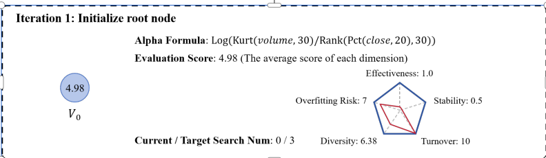
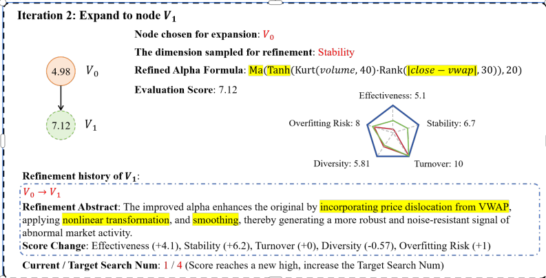
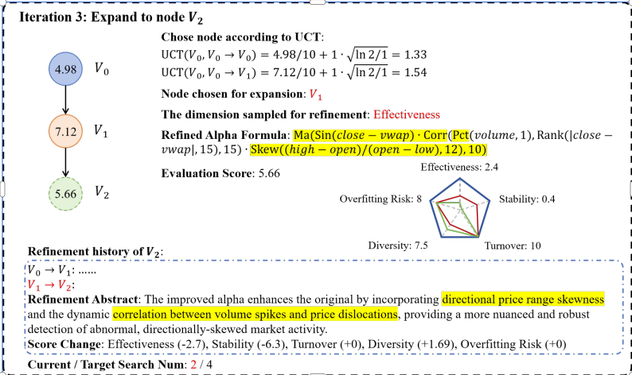
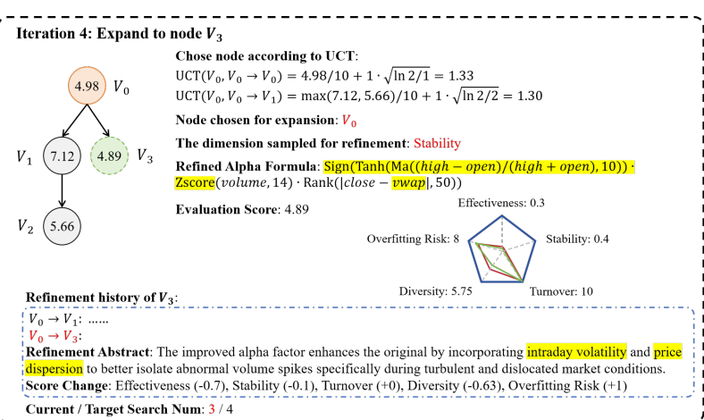

# 附录A：附录内容索引

> **本节作用：**  
> 本节为附录内容索引，介绍各附录章节的主题和功能，便于读者查阅。

本附录为主文中关于Alpha挖掘框架的方法、实验与发现，提供了丰富的补充材料。内容结构如下：

- **B节：案例分析。**  
  对本框架工作流程进行逐步演示说明。

- **C节：方法细节。**  
  详细阐述Alpha公式的生成过程及改进建议。

- **D节：算子列表。**  
  给出Alpha公式中涉及的全部算子列表。

- **E节：伪代码。**  
  提供本框架的算法伪代码。

- **F节：实验设置细节。**  
  包括超参数配置、模型规格、实验环境及预测性能指标等细节。

- **G节：扩展实验结果与分析。包括：**  
    - **G.1** 与其他基线方法的对比分析  
    - **G.2** 针对LLM潜在数据泄漏问题的研究  
    - **G.3** LLM骨干模型敏感性研究  
    - **G.4** 不同MCTS搜索深度下Alpha特性分析  
    - **G.5** 累计收益曲线可视化  
    - **G.6** 挖掘Alpha公式的可解释性分析  
    - **G.7** 框架关键参数的敏感性分析

- **H节：完整实验结果。**  
  包含预测性能对比实验（实验1）的全面结果。

- **I节：方法局限性。**  
  本框架存在的主要局限性说明。

- **J节：LLM Agent提示词。**  
  详述Alpha画像生成、公式生成、过拟合风险评估及Alpha优化等关键任务的提示词内容。

# 附录B：MCTS工作流案例分析

> **本节作用：**  
> 本节通过逐步案例详细说明了MCTS驱动的alpha挖掘框架的实际工作流程。

为了更直观地展示我们提出的MCTS因子挖掘框架的工作流程，本节将给出详细的逐步案例说明。

---

### 迭代1：初始化根节点

- **Alpha公式：**  
  $\mathrm{Log}(\mathrm{Kurt}(volume, 30)/\mathrm{Rank}(\mathrm{Pct}(close, 20), 30))$
- **评估得分：** 4.98（各维度得分的平均值）
    - 有效性：1.0
    - 稳定性：0.5
    - 过拟合风险：7
    - 多样性：6.38
    - 换手率：10

**当前/目标搜索次数：** 0 / 3

  
*图5：案例分析：MCTS根节点生成。*

如图5所示，首先由LLM生成初始alpha公式，并对该公式进行多维度评估，该节点作为MCTS搜索树的根节点($V_0$)。在本案例中，目标搜索次数初始化为3。每当新生成节点获得历史最高分时，目标搜索次数会动态增加1，以鼓励对有潜力的搜索树进行更深探索。

根节点构建完成后，MCTS流程进入节点扩展阶段。如图6所示，根节点$V_0$被扩展，生成其第一个子节点$V_1$。细化维度通过采样方式选取（本例中选择*稳定性*），LLM据此生成定向细化建议，并产生改进后的alpha公式，公式中的修改内容会在表达式中突出显示。改进后的alpha公式同样会进行多维度评估，获得$V_1$节点评分。同时，$V_1$的细化历史会记录本次细化步骤的摘要及相应分数变化。若$V_1$分数达到新高，则目标搜索次数增加，当前搜索次数也相应更新。

---

### 迭代2：扩展到节点 $V_1$

- **被扩展节点：** $V_0$
- **采样细化维度：** 稳定性
- **改进后Alpha公式：**  
  $\mathrm{Ma}(\mathrm{Tanh}(\mathrm{Kurt}(volume, 40)-\mathrm{Rank}(close-vwap, 30)), 20)$
- **评估得分：** 7.12
    - 有效性：5.1
    - 稳定性：6.7
    - 过拟合风险：8
    - 多样性：5.81
    - 换手率：10

**$V_1$的细化历史：**
- $V_0 \rightarrow V_1$
- **细化摘要：** 改进后的alpha通过**引入与VWAP的价格偏离**、**非线性变换**与**平滑处理**，提升了对异常市场行为的鲁棒性和抗噪声能力。
- **分数变化：** 有效性（+4.1），稳定性（+6.2），换手率（+0），多样性（-0.57），过拟合风险（+1）

**当前/目标搜索次数：** 1 / 4（分数创新高，目标搜索次数加1）

  
*图6：案例分析：扩展至节点V1。*

扩展流程继续，如图7所示，基于UCT准则，下一个被选中的扩展节点为$V_1$。与前一步类似，采样选定细化维度，由LLM生成针对该维度的改进公式，经过多维度评估后生成节点$V_2$。值得注意的是，$V_2$的细化历史是累计的，包含从根节点$V_0$经$V_1$到$V_2$的所有细化步骤及评分变化。当前搜索次数随之增加。

---

### 迭代3：扩展到节点 $V_2$

- **按UCT选择节点：**  
    - $\mathrm{UCT}(V_0, V_0 \rightarrow V_0) = 4.98 / 10 + 1 \cdot \sqrt{\ln 2 / 1} = 1.33$  
    - $\mathrm{UCT}(V_0, V_0 \rightarrow V_1) = 7.12 / 10 + 1 \cdot \sqrt{\ln 2 / 1} = 1.54$
- **被扩展节点：** $V_1$
- **采样细化维度：** 有效性
- **改进后Alpha公式：**  
  $\mathrm{Ma}(\mathrm{Sin}(close-vwap) - \mathrm{Corr}(\mathrm{Pct}(volume,1), \mathrm{Rank}(close-vwap,15), 15), 15) \cdot \mathrm{Skew}((high-open)/(open-low),12),10)$
- **评估得分：** 5.66
    - 有效性：2.4
    - 稳定性：0.4
    - 过拟合风险：8
    - 多样性：7.5
    - 换手率：10

**$V_2$的细化历史：**
- $V_0 \rightarrow V_1 \rightarrow V_2$
- **细化摘要：** 改进后的alpha进一步融合了**价格区间偏度和成交量突发与价格偏离的动态相关性**，从而实现了对异常、方向性偏斜市场活动的更细致鲁棒检测。
- **分数变化：** 有效性（-2.7），稳定性（-6.3），换手率（+0），多样性（+1.69），过拟合风险（+0）

**当前/目标搜索次数：** 2 / 4

  
*图7：案例分析：扩展至节点V2。*

图8与图9展示了后续两步扩展的结果，分别生成了$V_3$和$V_4$节点。扩展到$V_4$节点后，当前搜索次数达到预设目标，本轮MCTS扩展阶段结束。此时对所有生成的节点($V_0$至$V_4$)逐一筛查，满足质量和性能标准的节点会被收录至有效alpha仓库。

上述流程完成了MCTS驱动的alpha挖掘一轮完整迭代。该框架可持续循环此过程，实现高效、系统性地挖掘有效alpha。

---

### 迭代4：扩展到节点 $V_3$

- **按UCT选择节点：**  
    - $\mathrm{UCT}(V_0, V_0 \rightarrow V_0) = 4.98 / 10 + 1 \cdot \sqrt{\ln 2 / 1} = 1.33$  
    - $\mathrm{UCT}(V_0, V_0 \rightarrow V_1) = \max(7.12, 5.66) / 10 + 1 \cdot \sqrt{\ln 2 / 2} = 1.30$
- **被扩展节点：** $V_0$
- **采样细化维度：** 稳定性
- **改进后Alpha公式：**  
  $\mathrm{Sign}(\mathrm{Tanh}(\mathrm{Ma}((high-open)/(high+open),10))) \cdot \mathrm{Zscore}(volume,14) \cdot \mathrm{Rank}(close-vwap,50)$
- **评估得分：** 4.89
    - 有效性：0.3
    - 稳定性：0.4
    - 过拟合风险：8
    - 多样性：5.75
    - 换手率：10

**$V_3$的细化历史：**
- $V_0 \rightarrow V_1$ ...
- $V_0 \rightarrow V_3$
- **细化摘要：** 改进后的alpha因子通过**融合日内波动和价格分布特征**，能够更好地在剧烈波动和市场错位时刻识别异常成交量突发。
- **分数变化：** 有效性（-0.7），稳定性（-0.1），换手率（+0），多样性（-0.63），过拟合风险（+1）

**当前/目标搜索次数：** 3 / 4

  
*图8：案例分析：扩展至节点V3。*

# C 方法细节

> **本节作用：**  
> 本节详细说明了本文框架中alpha公式与精炼建议的生成过程，为复现与深入理解算法提供技术细节。

---

## C.1 Alpha公式生成

我们将alpha公式的生成过程分解为两步：首先生成**alpha画像（alpha portrait）**，然后基于该画像推导出具体的alpha公式。Alpha画像是一种文本描述，包含该alpha的名称、简要说明以及以伪代码形式表达的公式。该两步法将alpha的概念设计与具体公式构建解耦，有助于降低LLM的指令跟随复杂度，并提升生成公式的质量。

在生成alpha公式时，LLM会被要求使用符号参数（如移动平均的回看窗口长度），而非直接给出具体数值参数。同时，LLM会提出若干组候选参数（本文实验中为三组）。我们对每组参数对应的alpha公式进行回测，并选择表现最优的参数配置。此策略实现了对每个生成alpha公式的高效探索和利用。

---

## C.2 精炼建议生成

在每轮细化过程中，当选定需要改进的评估维度后，我们利用LLM生成针对性的精炼建议。这里采用了few-shot学习方式，以有效alpha仓库中的因子作为示例，并针对不同的评估维度定制示例筛选策略：

- **有效性与稳定性**  
  为了选择多样且强力的示例，首先过滤有效alpha仓库，仅保留与当前alpha相关性不在前$\eta\%$（如$\eta = 50$）的因子。在此基础上，挑选有效性或稳定性得分最高的前$k$个alpha（如$k=3$）作为few-shot示例。两步筛选确保示例多样，避免相似因子主导示例集合。

- **多样性**  
  鼓励结构创新时，从有效alpha仓库中筛选与当前alpha相关性最低的前$k$个因子作为示例。

- **换手率与过拟合风险**  
  这两个维度采用zero-shot模式，直接向LLM发出改进建议请求，无需显式示例。

获得精炼建议后，LLM根据建议生成改进后的alpha公式。我们会对生成的公式进行语法校验，如有语法错误，将反复提示LLM修正，直到通过校验为止。

---

# D 算子列表

> **本节作用：**  
> 本节罗列了本文实验中用于alpha公式构建的全部算子，分为一元与二元算子。

本文使用的算子分为**一元算子**与**二元算子**两类，均为时序算子，可作用于单日或包含历史数据。具体如下表所示：

---

| 算子 | 类型   | 说明 |
|------|--------|------|
| $-x$, $|x|$, $x^2$, $1/x$ | 一元 | $x$的相反数/绝对值/平方/倒数 |
| $\mathrm{Sign}(x)$ | 一元 | $x$的符号函数 |
| $\mathrm{Sin}(x)$, $\mathrm{Cos}(x)$, $\mathrm{Tanh}(x)$ | 一元 | 正弦、余弦、双曲正切函数 |
| $\mathrm{Log}(x)$ | 一元 | $x$的自然对数 |
| $\mathrm{Delay}(x, t)$ | 一元 | $x$在$t$个交易日前的取值 |
| $\mathrm{Diff}(x, t)$ | 一元 | $x$与$t$日前取值之差，$x - \mathrm{Delay}(x, t)$ |
| $\mathrm{Pct}(x, t)$ | 一元 | $x$相对于$t$日前的变化率 |
| $\mathrm{Ma}(x, t)$, $\mathrm{Med}(x, t)$, $\mathrm{Sum}(x, t)$ | 一元 | $x$过去$t$日的均值/中位数/求和 |
| $\mathrm{Std}(x, t)$ | 一元 | $x$过去$t$日的标准差 |
| $\mathrm{Max}(x, t)$, $\mathrm{Min}(x, t)$ | 一元 | $x$过去$t$日的最大/最小值 |
| $\mathrm{Rank}(x, t)$ | 一元 | $x$在过去$t$日的排名 |
| $\mathrm{Skew}(x, t)$, $\mathrm{Kurt}(x, t)$ | 一元 | $x$过去$t$日的偏度/峰度 |
| $\mathrm{Vari}(x, t)$ | 一元 | $x$过去$t$日的变异系数，$\mathrm{Std}(x, t)/\mathrm{Ma}(x, t)$ |
| $\mathrm{Autocorr}(x, t, n)$ | 一元 | $x$过去$t$日，滞后$n$的自相关系数 |
| $\mathrm{Zscore}(x, t)$ | 一元 | $x$基于过去$t$日均值和标准差的z-score标准化 |
| $x + y$, $x - y$, $x \cdot y$, $x/y$ | 二元 | 基本算术运算符 |
| $\mathrm{Greater}(x, y)$, $\mathrm{Less}(x, y)$ | 二元 | 判断$x$是否大于/小于$y$ |
| $\mathrm{Cov}(x, y, t)$ | 二元 | $x$与$y$过去$t$日的协方差 |
| $\mathrm{Corr}(x, y, t)$ | 二元 | $x$与$y$过去$t$日的皮尔逊相关系数 |

*表2：实验中用到的全部算子列表。*

---
# E 伪代码

> **本节作用：**  
> 本节给出LLM指导的MCTS框架的核心伪代码，明确每一步操作流程。

下方为我们的LLM引导的MCTS自动化Alpha挖掘框架的伪代码（算法1）。

---

```python
算法1：LLM引导的MCTS自动Alpha因子挖掘框架

输入: f_seed（初始alpha），L（LLM），c（探索常数），T（温度），e_max（各维度最大分数），B（初始搜索预算），b（预算增量），τ（有效性阈值），A_avoid（初始规避列表）

输出: 有效alpha仓库R

/* 初始化 */
1  R ← ∅
2  s_0 ← CreateRootNode(f_seed)
3  s_0.scores ← MultiDimEvaluate(f_seed, R)
4  s_0.visits ← 1; s_0.Q ← AggregateScore(s_0.scores)
5  Tree T ← {s_0}
6  max_score_overall ← s_0.Q // 跟踪当前树中最高分数

7  for i ← 1 to B do
/* 选择阶段 */
8    P_path ← SelectPathUsingUCT(T, s_0, c) // 选路径
9    s_selected ← LastNodeInPath(P_path)

/* 扩展阶段 */
/* 1. 优先细化维度 */
10   E_s ← s_selected.scores
11   P_dim(d) ← Softmax((e_max*1_q - E_s)/T)
12   d_chosen ← SampleDimension(P_dim)

/* 2. LLM生成细化建议与新alpha公式 */
13   context ← GetNodeRefinementContext(s_selected, T) // 父节点、子节点、兄弟节点历史
14   examples ← SampleEffectiveAlphas(R) // few-shot示例
15   f̃_desc, f'_formula ← L.GenerateRefinedAlpha(formula(s_selected), d_chosen, context, examples, A_avoid)

/* 3. 公式校验与修正 */
16   while ¬IsValid(f'_formula) do
17     feedback ← GetInvalidityReason(f'_formula)
18     f̃_desc, f'_formula ← L.CorrectAlphaFormula(f̃_desc, feedback, context, examples, A_avoid)
19   end

/* 新alpha评估 */
20   E_f' ← MultiDimEvaluate(f'_formula, R) // 含相对排名、LLM判别过拟合
21   score_f' ← AggregateScore(E_f')

/* 若新分数创新高，更新预算 */
22   if score_f' > max_score_overall then
23     B ← B + b // 总预算加1
24     max_score_overall ← score_f'
25   end

/* 新节点入树 */
26   s' ← CreateNode(f'_formula, E_f', score_f')
27   s'.summary ← L.GenerateRefinementSummary(s_selected, f̃_desc, E_f')
28   AddChildNode(T, s_selected, s')
29   A_avoid ← UpdateAvoidanceList(A_avoid, f'_formula)

/* 仓库更新 */
30   if GetEffectivenessScore(E_f') ≥ τ then
31     R ← R ∪ {f'_formula}
32   end

/* 反向传播 */
33   forall v ∈ P_path ∪ {s'} do
34     v.visits ← v.visits + 1
35     v.Q ← max(v.Q, score_f') // Q(v)为子树最大分
36   end
37 end
38 return R
```

# F 实验设置细节

> **本节作用：**  
> 本节详细说明本文所有实验的超参数配置、回测与建模策略、环境设置及指标计算公式，确保复现性和严谨性。

---

## F.1 超参数配置

**LLM温度参数**  
- 生成alpha画像和公式时，温度设为1.0  
- 修正非法alpha公式时，温度设为0.8  
- 评估alpha过拟合风险时，温度设为0.1

**MCTS设置**  
- UCT准则中的探索权重$c$设为1  
- 每棵搜索树初始搜索预算为3，节点分数创新高时预算加1

**有效Alpha筛选**  
每次搜索树扩展结束后，对所有节点的alpha公式进行有效性检测，通过检测的公式加入有效alpha仓库。判断标准如下：

- **基础标准：** RankIC $\geq$ 0.015，RankIR $\geq$ 0.3，RRankIC $\leq$ 0.95，RRankIR $\leq$ 0.95  
- **换手率标准：** 日换手率 $\leq$ 1.6  
- **多样性标准：** 与仓库中其他alpha最大相关性小于0.8

挖掘结束后，从有效alpha仓库中选取RankIR最高的top $k$（$k$取值为10、50、100）组成最终alpha集。

**评估打分维度**  
用于各维度得分的回测指标如下：

- **有效性：** RankIC  
- **稳定性：** RankIR  
- **换手率：** 日换手率  
- **多样性：** 与仓库中alpha最大相关性

**其它设置**  
生成alpha细化建议时few-shot示例数设为1；FSA方法中频繁子树规避数设为3。各评估维度采样概率温度$T=1$。有效性和稳定性细化建议生成时，相关性过滤比例$\eta = 50\%$。

---

## F.2 模型配置

为保证不同方法下alpha池评测公平，模型参数固定如下。

**LightGBM模型：**  
- num_leaves: 32  
- n_estimators: 200  
- max_depth: 8  
- learning_rate: 0.05  
- reg_alpha: 0.1  
- reg_lambda: 0.1

**多层感知机MLP：**  
- 3层隐藏层，单元数分别为256, 128, 64  
- 每层后Dropout 0.3  
- Adam优化器，学习率0.001  
- 批大小1024  
- 损失函数：均方误差（MSE）  
- Early stopping：验证集loss无提升5轮即停

---

## F.3 回测策略

回测采用top-$k$/drop-$n$等权组合策略：  
每日根据模型预测信号，选择排名前$k$只股票等权持有。$k$为股票池总数的10%（如沪深300指数$k=30$，中证1000指数$k=100$）。为控制换手与成本，每日最多买卖$n$只股票，$n=k/w$，$w$为预测周期（如沪深300用10日预测，$n=30/10=3$）。这样保证组合理论满换手期等于预测周期。回测中假设每次交易成本为0.15%。

---

## F.4 环境设置

所有实验均在如下环境下进行：

- **CPU:** AMD EPYC 7642 48核处理器  
- **GPU:** NVIDIA GeForce RTX 3080Ti  
- **操作系统:** Ubuntu 20.04.3 LTS  
- **软件版本:** Python 3.8.5；Numpy 1.24.4；Pandas 1.5.2；Pytorch 2.2.2；Openai 1.57.4

---

## F.5 预测性能评价指标

我们采用如下标准指标评估（基于所挖掘alpha集训练的）模型对股票收益的预测能力：信息系数（IC）、秩信息系数（RankIC）、年化收益（AR）、信息比率（IR）。设$f_{i,t}$为$t$时股票$i$的预测收益（股票池为$N_t$只），$r_{i,t+1}$为下一期实现收益，评价期为$T$期。

**信息系数（IC）**  
IC衡量预测与实现收益的线性相关性，按时间截面分别计算并取均值：
\[
\mathrm{IC}_t = \frac{\sum_{i=1}^{N_t} (f_{i,t} - \bar{f}_t)(r_{i,t+1} - \bar{r}_{t+1})}{\sqrt{\sum_{i=1}^{N_t} (f_{i,t} - \bar{f}_t)^2} \sqrt{\sum_{i=1}^{N_t} (r_{i,t+1} - \bar{r}_{t+1})^2}}
\]
\[
\mathrm{IC} = \frac{1}{T} \sum_{t=1}^{T} \mathrm{IC}_t
\]
$\bar{f}_t$、$\bar{r}_{t+1}$为当期预测与实现收益的截面均值。IC越高，预测能力越强。

**秩信息系数（RankIC）**  
RankIC反映预测与实现收益的单调关系（Spearman秩相关），对极端值更鲁棒。计算同IC，分截面再取均值：
\[
\mathrm{RankIC}_t = \mathrm{Corr}(\mathrm{rank}(f_{1,t},...,f_{N_t,t}), \mathrm{rank}(r_{1,t+1},...,r_{N_t,t+1}))
\]
\[
\mathrm{RankIC} = \frac{1}{T} \sum_{t=1}^{T} \mathrm{RankIC}_t
\]
$\mathrm{rank}(\cdot)$为排序操作，$\mathrm{Corr}$为皮尔逊相关。

**年化收益（AR）**  
AR为等权组合年平均收益。每期选top-$k$股票等权持有，组合当期收益：
\[
R_{p,t+1} = \frac{1}{k} \sum_{s \in \mathrm{TopK}_t} r_{s,t+1}
\]
AR为各期收益均值乘以年化期数$P$（如日频$P=252$，月频$P=12$）：
\[
\mathrm{AR} = \left(\frac{1}{T_p} \sum_{j=1}^{T_p} R_{p,j}\right) \times P
\]

**信息比率（IR）**  
IR衡量风险调整后年化收益，定义为AR除以组合收益年化波动率：
\[
\mathrm{IR} = \frac{\mathrm{AR}}{\sigma(R_p)} \sqrt{P}
\]
其中$\mathrm{AR}$为上式年化收益，$\sigma(R_p)$为各期组合收益标准差，$P$为年化周期数。IR越高，单位风险收益越高。


# G 附加结果

### G.1 与其他基线方法的对比

为了全面评估我们提出的框架，我们与量化投资领域中广泛采用的两个基准 alpha 集进行了对比：Alpha158 和 Alpha360。Alpha158 由 158 个手工构建的 alpha 因子组成，主要基于历史价格和成交量数据，常用于中国 A 股市场。Alpha360 则是一个更为庞大的集合，包含 360 个 alpha，旨在捕捉更广泛的市场信号。这两组基准因子的选择，体现了其在行业中的普及性，以及在 alpha 构建方法上的多样性，能够为评测提供稳健的参考依据。我们基于 Qlib 平台 [Yang 等, 2020] 提供的信息，构建了这两组基准。

我们评估了三种不同模型的预测性能：线性回归（LR）、LightGBM 和 3 层多层感知机（MLP）。每个模型分别使用以下特征集训练：（i）Alpha158，（ii）Alpha360，以及（iii）我们方法挖掘得到的 alpha 集。对比结果见表 3。正如所示，我们的方法在各类实验设置和模型架构下均表现出更优的预测性能，凸显了其在发现更有效 alpha 信号方面的能力。

| 标的      | ∆T | Alpha集    |      | LR      |        | LightGBM | MLP    |        |
|-----------|----|------------|------|---------|--------|----------|--------|--------|
|           |    |            | IC   | RankIC  | IC     | RankIC   | IC     | RankIC |
|           |    | Alpha158   |0.0280| 0.0257  | 0.0386 | 0.0377   | 0.0337 | 0.0329 |
|           | 10 | Alpha360   |0.0144| 0.0169  | 0.0061 | -0.0096  | 0.0153 | 0.0231 |
| CSI300    |    | Ours(100)  |0.0325| 0.0303  | 0.0420 | 0.0395   | 0.0422 | 0.0408 |
|           | 30 | Alpha158   |0.0147| 0.0140  | 0.0028 | 0.0103   | 0.0036 | 0.0036 |
|           |    | Alpha360   |-0.0069|-0.0072 | -0.0539| -0.0702  | 0.0235 | 0.0340 |
|           |    | Ours(100)  |0.0373| 0.0359  | 0.0417 | 0.0401   | 0.0423 | 0.0424 |
| CSI1000   | 10 | Alpha158   |0.0395| 0.0548  | 0.0610 | 0.0627   | 0.0520 | 0.0567 |
|           |    | Alpha360   |0.0385| 0.0586  | 0.0636 | 0.0642   | 0.0550 | 0.0608 |
|           |    | Ours(100)  |0.0589| 0.0554  | 0.0804 | 0.0729   | 0.0662 | 0.0618 |
|           | 30 | Alpha158   |0.0512| 0.0507  | 0.0490 | 0.0654   | 0.0380 | 0.0373 |
|           |    | Alpha360   |0.0538| 0.0537  | 0.0420 | 0.0567   | 0.0532 | 0.0456 |
|           |    | Ours(100)  |0.0597| 0.0555  | 0.0793 | 0.0723   | 0.0738 | 0.0710 |

表3：我们框架与其他基线方法的预测性能对比。对于我们的方法，alpha集规模固定为100。

---

### G.2 大模型潜在数据泄露风险探究

在使用大模型（LLM）进行 alpha 挖掘时，一个重要风险是**数据泄露**：即大模型训练数据中是否包含历史上表现优异的 alpha 公式，如果 LLM 只是“背诵”这些公式，可能导致其生成能力被高估。

为验证这一点，我们设计了实验，显式测试大模型是否拥有此类“先验知识”。我们分别对三种主流 LLM（GPT-4.1、Gemini2.0 flash-lite、Deepseek-v3）提出直接生成高表现 alpha 的要求（目标：CSI300，10日收益预测）。每种 LLM 及随机基线各生成10个 alpha，报告各方法平均性能，并与我们框架挖掘的 alpha 对比。

| LLM                | IC     | RankIC | IR    | RankIR |
|--------------------|--------|--------|-------|--------|
| 随机                | 0.0126 | 0.0179 | 0.095 | 0.148  |
| GPT4.1             | 0.0130 | 0.0242 | 0.097 | 0.168  |
| Gemini2.0-flash-lite|0.0125 | 0.0231 | 0.094 | 0.180  |
| Deepseek-v3-0324   | 0.0122 | 0.0223 | 0.087 | 0.145  |
| Ours               | 0.0527 | 0.0714 | 0.368 | 0.467  |

如表4所示，直接提示 LLM 生成高表现 alpha 时，其结果与随机基线无明显差别，且远逊于我们框架。这表明现有 LLM 在本任务上并无明显数据泄露风险，也凸显了我们方法的有效性。

---
### G.3 大模型主干选择的敏感性分析

我们评估了不同大模型主干（LLM backbone）对本框架的影响。共测试了三种模型：GPT-4.1、Gemini-2.0-flash-lite 和 Deepseek-v3。实验在 CSI300 股票池上进行，目标是预测10日未来收益，alpha 因子集规模设为50。详细结果见表5。实验结果显示，不同的 LLM 主干会导致生成的 alpha 集在表现特性上存在显著差异。虽然每种 LLM 强调的 alpha 质量侧重点略有不同，但在采用这些先进模型时，我们框架整体性能通常可以达到或超越所有基线方法的最优结果。

表5：在 CSI300 数据集（10日未来收益，alpha 集规模为50）上，不同 LLM 主干下本框架的表现对比。最佳结果已加粗标记。

| LLM                                    | IC     | RankIC | AR     | IR     | IC     | RankIC | AR     | IR     |
|----------------------------------------|--------|--------|--------|--------|--------|--------|--------|--------|
| Best of Baselines                      | 0.0388 | 0.0378 | 0.0680 | 0.7470 | 0.0380 | 0.0374 | 0.0805 | 0.8414 |
| GPT4.1 / Gemini2.0-flash-lite / Deepseek-v3 | 0.0399 / 0.0376 / 0.0388 | 0.0394 / 0.0363 / 0.0378 | 0.0717 / 0.1037 / 0.0680 | 0.8283 / 1.1096 / 0.7470 | 0.0436 / 0.0389 / 0.0380 | 0.0425 / 0.0372 / 0.0374 | 0.0661 / 0.1734 / 0.0805 | 0.7075 / 1.9801 / 0.8414 |

---

### G.4 不同 MCTS 搜索深度下 Alpha 的特征

本节分析了 MCTS 搜索树不同深度节点生成的 alpha 因子的特性。树中更深层的 alpha 经过了更多轮的精细化迭代。图10 展示了多个关键指标随 MCTS 深度的演变过程，包括平均公式深度（公式树的层级）、公式长度（运算符数量）、样本内（IS）及样本外（OOS）的 RankIC，以及过拟合风险评分。

实验观察发现，随着 MCTS 搜索深度的增加，平均公式深度与长度均呈现先上升后趋于稳定的趋势。这种稳定主要归因于过拟合风险评分机制，会对过于复杂、易过拟合的公式进行惩罚。同时，平均 IS 和 OOS 的 RankIC 随深度增加整体上升，反映出精细化优化过程的有效性。而 alpha 的泛化能力（即 IS 与 OOS RankIC 的差值，即泛化差距）则逐步减小。这一趋势与过拟合风险评分的行为一致，说明虽然迭代优化能提升表现，但随之而来的过拟合风险需谨慎管理，这正是我们的 ORS（Overfitting Risk Score）所要解决的问题。

## G.5 累计收益曲线可视化

图11 展示了基于不同方法挖掘出的 alpha 在回测中的累计收益曲线。如图所示，我们提出的方法始终表现出更优的业绩，在所有被评估的方法中实现了最高的累计收益。

---

## G.6 挖掘出的 Alpha 公式可解释性

表6 展示了我们框架与非LLM基线挖掘出的部分代表性 alpha 公式。我们框架生成的公式普遍具有明确的金融直觉。例如，alpha "Zscore(Ma(close − vwap, 20), 30)" 可以通过衡量近阶段收盘价与成交量加权平均价之差的历史偏离程度，直观反映买卖压力。相比之下，其他基线方法生成的公式往往结构更复杂、不够透明，其金融逻辑较难解释。

---

| 方法       | Alpha 公式                                                                          |
|------------|-------------------------------------------------------------------------------------|
| Ours       | 1. Zscore(Ma(close − vwap, 20), 30)                                                 |
|            | 2. Std(Pct(vwap, 20), 25) · Sum(volume, 40)/volume                                  |
|            | 3. Corr(close, volume, 50) · Zscore(Ma(close − vwap, 30), 40)                       |
|            | 4. Diff(Ma(volume, 20), 3)/Ma(volume, 60)                                           |
|            | 5. Corr(Pct(close, 10),Pct(volume, 10), 10) · Corr(Pct(close, 30),Pct(volume, 30),30)·Skew(volume,20)|
|            | 6. Ma(Corr(volume, close, 20) · Skew(high − low, 20), 10)                           |
| GP         | 1. Add(Mul(−0.01, volume), Log(Log(close)))                                         |
|            | 2. Less(Cov(open, Add(high, Div(volume, −5)), 10), Std(Log(close), 50))             |
| DSO        | 1. Greater(volume, Med(Sub(Ma(open, 10), Med(Std(Sign(close), 10), 10)), 10))       |
|            | 2. Cov(Med(Sign(vwap), 50), 5, 20)                                                  |
| AlphaGen   | 1. Corr(Rank(Diff(Greater(2.0, volume), 50), 10), close, 20)                        |
|            | 2. Ma(Greater(Std(Less(0.01, Less(Div(Log(high), −2.0), −30)), 1), −30), 5)         |
| AlphaForge | 1. 1/(1/(Diff(Sin(1/(Cos(((0.01 + Sin(Tanh(high)))/30)))), 30)))                    |
|            | 2. (Cos(Tanh(Sin(Diff(Sin(30 + low), 20)))) + 30.0)                                 |

表6：我们框架及其他非LLM基线挖掘出的 alpha 公式示例。每个编号代表一个独立的 alpha 公式。

---

## G.7 框架关键超参数敏感性分析

本节分析了框架对两项关键超参数的敏感性：初始 MCTS 搜索预算 B（即每棵树的初始搜索次数）和 UCT 探索权重 c。实验在 CSI300 指数成分股上开展，目标为10日未来收益，alpha 集规模为50。图12 展示了不同参数组合下模型的表现。

对于初始 MCTS 搜索预算 B，当 B=3 时获得最佳表现。B 过大可能导致对低质量子树的过度探索，消耗大量计算资源却收效甚微；B 过小则可能导致潜在优质子树探索不充分，降低搜索效果。

对于 UCT 探索权重 c，结果表明 c 过大反而有害。过高的 c 会导致搜索过于平均、趋于随机，从而浪费对高潜力 alpha 的精细优化机会。

---

图12：不同初始 MCTS 搜索预算 B 和 UCT 探索权重 c 设定下的预测性能影响。

# H 完整实验结果

本节系统给出我们方法与各类基线方法的详细实验结果。表7与表8分别展示了在CSI300股票池上，LightGBM与MLP模型的对比实验结果。表9与表10则是同样两类模型在CSI1000股票池上的表现。

---

| ∆T | 方法        |        |        | Alpha数量=10 |        |        |        | Alpha数量=50 |        | Alpha数量=100 |        |        |        |
|----|------------|--------|--------|--------------|--------|--------|--------|--------------|--------|---------------|--------|--------|--------|
|    |            | IC     | RankIC | AR           | IR     | IC     | RankIC | AR           | IR     | IC            | RankIC | AR     | IR     |
|    | GP         | 0.0165 | 0.0148 | 0.0138       | 0.1717 | 0.0248 | 0.0246 | 0.0570       | 0.6777 | 0.0319        | 0.0288 | 0.0716 | 0.7222 |
|    | DSO        | 0.0079 | 0.0090 | 0.0434       | 0.6125 | 0.0174 | 0.0178 | -0.0569      | -0.6460| 0.0246        | 0.0247 | -0.0090| -0.1069|
|    | AlphaGen   | 0.0443 | 0.0411 | 0.0119       | 0.1335 | 0.0388 | 0.0378 | -0.0342      | -0.3473| 0.0446        | 0.0416 | 0.0094 | 0.1091 |
|    | AlphaForge | 0.0521 | 0.0518 | 0.0231       | 0.2653 | 0.0293 | 0.0271 | 0.0252       | 0.3005 | 0.0407        | 0.0387 | -0.0253| -0.3004|
| 10 | CoT        | 0.0201 | 0.0206 | 0.0549       | 0.6713 | 0.0240 | 0.0224 | 0.0600       | 0.6683 | 0.0237        | 0.0225 | 0.0600 | 0.6681 |
|    | ToT        | 0.0269 | 0.0267 | 0.0387       | 0.4335 | 0.0256 | 0.0242 | 0.0680       | 0.7365 | 0.0358        | 0.0332 | 0.0620 | 0.6872 |
|    | FAMA       | 0.0210 | 0.0206 | 0.0175       | 0.2103 | 0.0243 | 0.0227 | 0.0593       | 0.7470 | 0.0292        | 0.0281 | 0.0585 | 0.6868 |
|    | Ours       | 0.0386 | 0.0364 | 0.0668       | 0.7485 | 0.0399 | 0.0394 | 0.0717       | 0.8283 | 0.0420        | 0.0395 | 0.0822 | 0.9397 |
|    | GP         | 0.0145 | 0.0118 | 0.0322       | 0.3857 | 0.0248 | 0.0246 | 0.0570       | 0.6777 | 0.0319        | 0.0288 | 0.0716 | 0.7222 |
|    | DSO        | 0.0079 | 0.0090 | -0.0050      | -0.0682| 0.0174 | 0.0178 | 0.0156       | 0.1735 | 0.0246        | 0.0247 | 0.0185 | 0.2039 |
|    | AlphaGen   | 0.0299 | 0.0280 | 0.0597       | 0.7792 | 0.0322 | 0.0286 | 0.0150       | 0.1540 | 0.0401        | 0.0339 | 0.0548 | 0.4662 |
|    | AlphaForge | 0.0326 | 0.0322 | 0.0981       | 0.9455 | 0.0286 | 0.0278 | 0.0551       | 0.7341 | 0.0339        | 0.0315 | 0.0164 | 0.2176 |
| 30 | CoT        | 0.0200 | 0.0186 | 0.0774       | 0.9554 | 0.0274 | 0.0250 | 0.0574       | 0.6105 | 0.0278        | 0.0247 | 0.0468 | 0.5037 |
|    | ToT        | 0.0232 | 0.0247 | 0.1064       | 1.3221 | 0.0291 | 0.0285 | 0.0632       | 0.7982 | 0.0348        | 0.0312 | 0.0587 | 0.7037 |
|    | FAMA       | 0.0298 | 0.0307 | 0.1050       | 1.1609 | 0.0285 | 0.0298 | 0.0803       | 0.9502 | 0.0301        | 0.0297 | 0.0934 | 1.1629 |
|    | Ours       | 0.0334 | 0.0334 | 0.1129       | 1.3286 | 0.0352 | 0.0340 | 0.0886       | 1.1299 | 0.0417        | 0.0401 | 0.0826 | 1.0312 |

表7：LightGBM模型在CSI300股票池上、不同方法挖掘的alpha下的预测性能。

---

| ∆T | 方法        |         |        | Alpha数量=10 |         |        |        | Alpha数量=50 |         | Alpha数量=100 |        |        |        |  |
|----|------------|---------|--------|--------------|---------|--------|--------|--------------|---------|---------------|--------|--------|--------|--|
|    |            | IC      | RankIC | AR           | IR      | IC     | RankIC | AR           | IR      | IC            | RankIC | AR     | IR     |  |
|    | GP         | 0.0124  | 0.0120 | -0.0212      | -0.2240 | 0.0257 | 0.0233 | 0.0769       | 0.8324  | 0.0277        | 0.0266 | 0.0345 | 0.3967 |  |
|    | DSO        | 0.0085  | 0.0082 | 0.0485       | 0.5849  | 0.0062 | 0.0052 | -0.0263      | -0.2623 | 0.0256        | 0.0245 | 0.0019 | 0.0230 |  |
|    | AlphaGen   | 0.0419  | 0.0418 | 0.0725       | 0.8199  | 0.0380 | 0.0374 | 0.0524       | 0.6187  | 0.0311        | 0.0313 | 0.0295 | 0.3044 |  |
|    | AlphaForge | 0.0549  | 0.0554 | 0.0802       | 0.8397  | 0.0232 | 0.0207 | 0.0668       | 0.7509  | 0.0408        | 0.0395 | 0.0220 | 0.2555 |  |
| 10 | CoT        | 0.0207  | 0.0209 | 0.0608       | 0.7030  | 0.0260 | 0.0260 | 0.0500       | 0.5632  | 0.0263        | 0.0257 | 0.0592 | 0.6627 |  |
|    | ToT        | 0.0281  | 0.0278 | 0.0625       | 0.7185  | 0.0285 | 0.0286 | 0.0805       | 0.8414  | 0.0323        | 0.0316 | 0.0340 | 0.3770 |  |
|    | FAMA       | 0.0243  | 0.0227 | 0.0593       | 0.7470  | 0.0292 | 0.0281 | 0.0585       | 0.6868  | 0.0307        | 0.0319 | 0.1013 | 1.2209 |  |
|    | Ours       | 0.0411  | 0.0406 | 0.0741       | 0.8186  | 0.0436 | 0.0425 | 0.0661       | 0.7075  | 0.0422        | 0.0408 | 0.0737 | 0.8103 |  |
|    | GP         | 0.0149  | 0.0144 | 0.0541       | 0.6154  | 0.0262 | 0.0245 | 0.1422       | 1.5026  | 0.0220        | 0.0194 | 0.0815 | 0.7696 |  |
|    | DSO        | -0.0009 | 0.0017 | -0.0605      | -0.6320 | 0.0067 | 0.0057 | 0.0037       | 0.0378  | 0.0250        | 0.0230 | 0.0919 | 0.9969 |  |
|    | AlphaGen   | 0.0204  | 0.0190 | 0.0417       | 0.4695  | 0.0240 | 0.0257 | 0.0538       | 0.6088  | 0.0415        | 0.0400 | 0.1149 | 1.2440 |  |
|    | AlphaForge | 0.0348  | 0.0355 | 0.1162       | 1.0065  | 0.0283 | 0.0274 | 0.1004       | 1.2230  | 0.0317        | 0.0280 | 0.0732 | 0.9253 |  |
| 30 | CoT        | 0.0198  | 0.0188 | 0.1050       | 1.2943  | 0.0274 | 0.0264 | 0.1631       | 1.6693  | 0.0276        | 0.0250 | 0.1042 | 1.0422 |  |
|    | ToT        | 0.0265  | 0.0262 | 0.0975       | 1.1829  | 0.0355 | 0.0353 | 0.1330       | 1.5599  | 0.0337        | 0.0327 | 0.0584 | 0.7347 |  |
|    | FAMA       | 0.0341  | 0.0338 | 0.1173       | 1.3005  | 0.0302 | 0.0300 | 0.0596       | 0.6626  | 0.0331        | 0.0327 | 0.1012 | 1.0366 |  |
|    | Ours       | 0.0361  | 0.0359 | 0.1259       | 1.3210  | 0.0337 | 0.0340 | 0.1235       | 1.3931  | 0.0423        | 0.0424 | 0.1315 | 1.4307 |  |

表8：MLP模型在CSI300股票池上，不同方法挖掘的alpha下的预测性能。

---

| ∆T | 方法        | Alpha数量=10 |        |        |        |        | Alpha数量=50 |        |        | Alpha数量=100 |        |        |        |
|----|------------|--------------|--------|--------|--------|--------|--------------|--------|--------|---------------|--------|--------|--------|
|    |            | IC           | RankIC | AR     | IR     | IC     | RankIC       | AR     | IR     | IC            | RankIC | AR     | IR     |
|    | GP         | 0.0621       | 0.0581 | 0.0965 | 0.8339 | 0.0627 | 0.0587       | 0.0956 | 0.8933| 0.0744        | 0.0646 | 0.1054| 1.0063 |
|    | DSO        | 0.0362       | 0.0368 | 0.0926 | 0.8602 | 0.0492 | 0.0466       | 0.1091 | 1.0195| 0.0609        | 0.0559 | 0.1137| 1.0720 |
|    | AlphaGen   | 0.0528       | 0.0511 | 0.0770 | 0.7751 | 0.0828 | 0.0720       | 0.0403 | 0.4799| 0.0793        | 0.0693 | 0.0816| 0.9041 |
|    | AlphaForge | 0.0702       | 0.0628 | 0.0768 | 0.7029 | 0.0664 | 0.0601       | 0.0881 | 0.7687| 0.0728        | 0.0631 | 0.0512| 0.4607 |
| 10 | CoT        | 0.0556       | 0.0498 | 0.0450 | 0.4726 | 0.0638 | 0.0574       | 0.0607 | 0.6113| 0.0670        | 0.0597 | 0.0602| 0.5818 |
|    | ToT        | 0.0619       | 0.0573 | 0.0993 | 0.9592 | 0.0599 | 0.0558       | 0.0954 | 0.9419| 0.0654        | 0.0585 | 0.0909| 0.8889 |
|    | FAMA       | 0.0631       | 0.0595 | 0.1053 | 0.9234 | 0.0643 | 0.0596       | 0.1134 | 1.0222| 0.0647        | 0.0584 | 0.1186| 1.0708 |
|    | Ours       | 0.0661       | 0.0603 | 0.1096 | 1.0919 | 0.0748 | 0.0677       | 0.1418 | 1.3699| 0.0804        | 0.0729 | 0.1393| 1.3577 |
|    | GP         | 0.0575       | 0.0522 | 0.0996 | 1.1359 | 0.0674 | 0.0637       | 0.0559 | 0.7088| 0.0706        | 0.0672 | 0.0496| 0.6230 |
|    | DSO        | 0.0362       | 0.0368 | 0.1181 | 1.1052 | 0.0420 | 0.0397       | 0.1096 | 1.2138| 0.0609        | 0.0559 | 0.1226| 1.1488 |
|    | AlphaGen   | 0.0511       | 0.0502 | 0.1087 | 1.2971 | 0.0727 | 0.0634       | 0.0991 | 1.4196| 0.0685        | 0.0686 | 0.0520| 0.7458 |
|    | AlphaForge | 0.0558       | 0.0532 | 0.1095 | 0.9708 | 0.0705 | 0.0638       | 0.1081 | 0.9519| 0.0705        | 0.0611 | 0.0796| 0.8501 |
| 30 | CoT        | 0.0471       | 0.0438 | 0.1030 | 1.1473 | 0.0693 | 0.0629       | 0.1110 | 0.9757| 0.0743        | 0.0661 | 0.1118| 1.0872 |
|    | ToT        | 0.0475       | 0.0458 | 0.1340 | 1.4212 | 0.0643 | 0.0576       | 0.1097 | 1.1991| 0.0758        | 0.0694 | 0.1147| 1.1127 |
|    | FAMA       | 0.0543       | 0.0522 | 0.1136 | 0.9774 | 0.0550 | 0.0523       | 0.1340 | 1.2054| 0.0557        | 0.0523 | 0.1226| 1.0912 |
|    | Ours       | 0.0529       | 0.0506 | 0.1543 | 1.6588 | 0.0741 | 0.0673       | 0.1461 | 1.4065| 0.0793        | 0.0723 | 0.1326| 1.2598 |

表9&10：LightGBM/MLP模型在CSI1000股票池上，不同方法挖掘的alpha下的预测性能。

---

# I 局限性

尽管本框架在公式化 alpha 挖掘方面取得了积极进展，但仍存在若干局限值得讨论。

首先，虽然我们的方法可以生成有效的 alpha 公式，但在新颖性和复杂性上与部分人工专家研发的公式尚有差距。本框架有时难以产出极为复杂或非常规的 alpha。其次，所挖掘的 alpha 多样性受限于大模型自身的知识边界，这使得相较于某些非 LLM 基线方法，搜索空间的广度可能不足。

因此，将本方法大规模拓展到极为庞大且异质的 alpha 挖掘场景，仍然存在挑战。未来可考虑引入提升创新性的机制或进一步扩展搜索空间等方式加以改进。


# J LLM智能体提示词

在我们提出的框架中，LLM作为自主智能体，贯穿于Alpha公式挖掘的各个核心环节，包括公式生成、迭代细化以及过拟合风险评估等。本节详细介绍为引导LLM完成这些关键任务而精心设计的核心提示词。每个提示词都经过精心设计，以激发LLM产生特定行为和输出，确保Alpha因子挖掘流程的结构化和高效性。

## J.1 Alpha画像生成提示词

如图13所示，Alpha画像生成提示词用于基于可用的数据字段和算子等信息，生成一个Alpha画像。该Alpha画像随后用于生成对应的Alpha公式。

## J.2 Alpha公式生成提示词

如图14所示，Alpha公式生成提示词用于根据提供的Alpha画像及其他相关信息生成对应的Alpha公式。格式化后的Alpha公式便于后续的正确性校验与Alpha值的计算。

## J.3 Alpha过拟合风险评估提示词

如图15所示，Alpha过拟合风险评估提示词用于基于Alpha公式及其细化历史信息，评估Alpha的过拟合风险。我们在提示词中提供评估标准，辅助LLM进行关键性评判。

## J.4 Alpha细化提示词

如图16所示，Alpha细化提示词用于结合细化建议，对原始Alpha公式进行优化，从而生成改进后的新公式。

## 图13：Alpha画像生成提示词

---

**任务描述：**  
你是一位专注于因子投资的量化金融专家。请根据以下要求，设计一个可用于投资策略的Alpha因子，并以指定格式输出Alpha的内容。

**可用数据字段：**  
可用于设计Alpha的数据字段如下：  
`{available_fields}`

**可用算子：**  
可用于设计Alpha的算子如下：  
`{available_operators}`

**Alpha设计要求：**  
1. Alpha值应为无量纲（无单位）。
2. Alpha公式需至少包含“可用算子”中两种不同的操作，确保复杂性，避免过于简单。
3. 所有回溯窗口和数值参数必须作为具名参数体现在伪代码中，并遵循Python命名规范（如：lookback_period, volatility_window, smoothing_factor）。
4. Alpha中参数总数不得超过3个。
5. 伪代码应分步体现Alpha的计算过程，每行仅使用“可用算子”及已定义参数，且每行只代表一步操作。
6. 伪代码中使用具描述性的变量名，能清楚反映其代表的数据。
7. 设计Alpha表达式时，尽量避免出现如下子表达式：  
   `{freq_subtrees}`

**格式要求：**  
输出内容需为JSON格式，包含以下三组键值对：

1. `"name"`：Alpha名称，需为简洁的变量命名（遵循Python风格，如 price_volatility_ratio）。
2. `"description"`：简明解释该Alpha的用途或意义，避免过多技术术语，强调因子背后的直观动机。
3. `"pseudo_code"`：字符串列表，每行为一行简化伪代码，描述Alpha计算的某一步。每行格式为：  
   `variable_name = op_name([input1, input2, ...], param1=[...], param2=[...], ...)`
   其中：  
   - `variable_name`：操作的输出变量名  
   - `op_name`：所用的算子名  
   - `input1, input2...`：输入变量（可为“可用数据字段”或已计算变量，不可为数值型常量）  
   - `param1, param2...`：已在Alpha要求中定义的参数名

**格式示例：**
```json
{
  "name": "volatility_adjusted_momentum",
  "description": "......",
  "pseudo_code": [ ...... ]
}
```
## 图14：Alpha公式生成提示词

---

**任务描述：**  
请根据以下要求，设计一个量化投资用的Alpha表达式。

**可用数据字段：**  
可用于设计Alpha的数据字段如下：  
`{available_fields}`

**可用算子：**  
可用于设计Alpha的算子如下：  
`{available_operators}`

**Alpha设计要求：**  
`{alpha_portrait_prompt}`

**格式要求：**  
1. 输出内容必须为JSON格式。
2. JSON对象包含两个字段："formula" 和 "arguments"。
   - `"formula"`：表示用于计算Alpha的数学表达式。
   - `"arguments"`：表示Alpha可配置的参数。
3. `"formula"` 是一个字典列表。每个字典代表Alpha计算中的一步操作，包含以下键：
   - `"name"`：操作名（字符串），必须为"可用算子"中的一种。
   - `"param"`：参数名列表，这些参数名需在"arguments"部分作为key出现。
   - `"input"`：输入变量名列表，必须来自"可用数据字段"或"formula"中的已有输出变量，不能为数值型常量。
   - `"output"`：该步操作输出变量名，可供后续操作使用。
4. `"arguments"` 是一个字典列表。每个字典为一组参数取值，包含所有"formula"中用到的参数：
   - 字典的key需与"formula"中"param"字段列出的参数名一一对应。
   - 字典中的value为该组参数的具体数值。
5. "arguments"字段中最多包含3组参数。
6. 用于指定回溯窗口长度的参数，其取值范围应在 `{window_range}` 内。
7. 确保Alpha公式既有合理的金融意义，也具备可计算性。
8. 参数名需具备描述性，并遵循Python命名规范（如 window_size, lag_period, smoothing_factor）。避免只用单字符或数字作为参数名。
9. 示例格式如下：

```json
{
  "formula": [ ...... ],
  "arguments": [ ...... ]
}
```
## 图15：Alpha过拟合风险评估提示词

---

**任务：Alpha过拟合风险关键性评估**  
请对所给定的量化投资Alpha表达式，根据其表达式及细化历史，严格评估其过拟合风险与泛化能力。你的评估需重点关注Alpha的复杂性和优化过程是否有合理依据，或是否存在过度拟合的迹象。

**输入：**
- **Alpha表达式：**  
  `{alpha_formula}`
- **细化历史：**  
  `{refinement_history}`

**评估标准：**

1. **合理动机 vs. 复杂性**  
   - *评议要点：* Alpha表达式的复杂性是否有合理的经济动机支撑，还是显得随意/冗余，存在“拟合噪声”的嫌疑？

2. **有原则的开发 vs. 数据挖掘**  
   - *评议要点：* 细化历史是否表现为基于假设的渐进优化，还是频繁且缺乏解释的参数微调，表现出“过度优化/拟合”倾向？

3. **透明度 vs. 不透明性**  
   - *评议要点：* Alpha的逻辑结构是否容易理解（即便较复杂），还是因表达式不透明掩盖了过拟合？

**打分与输出：**

- 给出一个**过拟合风险分数**，范围0-10分：
  - 10 = 极低风险（对泛化能力高度自信）
  - 0 = 极高风险（泛化能力信心极低）
- 请充分利用0-10分区分不同风险水平。
- 简明扼要地用一句话阐明**打分理由**，需明确指出支撑此分数的关键要素。
- 按如下JSON格式输出结果：

**JSON输出示例：**
```json
{
  "reason": "Complexity is justified by a strong rationale; principled refinement history suggests low risk.",
  "score": 9
}

{
  "reason": "Plausible rationale, but some expression opacity and parameter tuning in history indicate moderate risk.",
  "score": 5
}

{
  "reason": "High risk inferred from opaque expression lacking clear rationale, supported by history showing excessive tuning.",
  "score": 1
}
```

## 图16：Alpha细化提示词

---

**任务描述：**  
有一个用于量化投资预测资产价格趋势的Alpha因子。请根据下列细化建议，对其进行改进，并输出优化后的Alpha表达式。

**可用数据字段：**  
可用于设计Alpha的数据字段如下：  
`{available_fields}`

**可用算子：**  
可用于设计Alpha的算子如下：  
`{available_operators}`

**Alpha建议：**  
1. Alpha值应为无量纲（无单位）。
2. 所有回溯窗口和数值参数必须以具名参数形式在伪代码中体现，且需遵循Python命名规范（如 lookback_period, volatility_window, smoothing_factor）。
3. 参数总数不得超过3个。
4. 伪代码应分步体现Alpha的计算过程，每行仅用“可用算子”及已定义参数，每行只代表一步操作。
5. 伪代码中使用具描述性的变量名，能清楚反映其代表的数据。
6. 设计Alpha表达式时，尽量避免出现如下子表达式：  
   `{freq_subtrees}`

---

**原始alpha表达式：**  
`{origin_alpha_formula}`

**细化建议：**  
*注意：*下列细化建议无需全部采纳，只需择优、合理采纳部分即可。  
`{refinement_suggestions}`

---

**格式要求：**  
输出需为JSON格式，包含以下三组键值对：

1. `"name"`：Alpha名称，简洁并遵循Python变量命名风格（如 price_volatility_ratio）。
2. `"description"`：简要说明该Alpha的用途和意义，避免过多技术术语，强调因子背后的直观动机。
3. `"pseudo_code"`：字符串列表，每行为一行简化伪代码，描述Alpha计算的某一步，格式如下：  
   `variable_name = op_name([input1, input2, ...], param1=[...], param2=[...], ...)`
   - `variable_name`：该步输出变量名
   - `op_name`：所用算子名
   - `input1, input2...`：输入变量（可为“可用数据字段”或前面步骤已算得变量，不可为常数）
   - `param1, param2...`：参数名，需在Alpha要求中已定义

**示例格式：**
```json
{
  "name": "volatility_adjusted_momentum",
  "description": "......",
  "pseudo_code": [ ...... ]
}
```