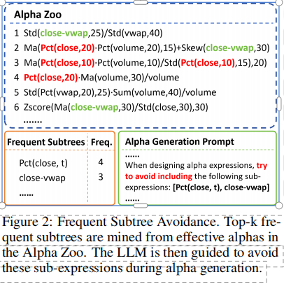
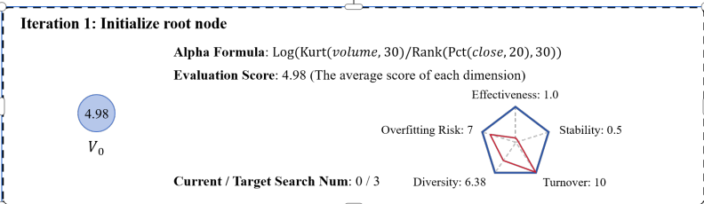
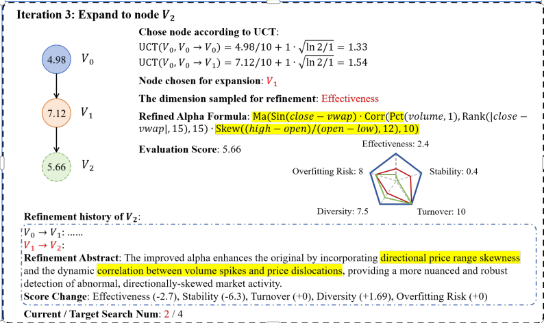
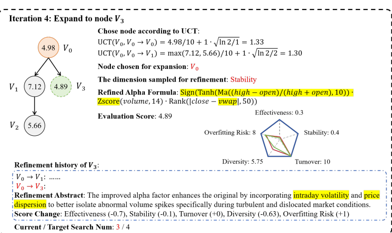

# 1 Introduction

> **本节作用：**  
> 本节介绍论文背景、公式化alpha挖掘的研究现状、主要挑战，以及本文所提出方法的理论基础和创新点。

Predicting price movements in financial markets, characterized by low signal-to-noise ratios, remains a central challenge in quantitative investment. A common strategy to enhance model predictiveness is the extraction of predictive signals, or alpha factors (hereafter sometimes simply “alpha”), from stock data [Qian et al. 2007; Tulchinsky 2019]. Current alpha factor mining methodologies broadly fall into two categories: neural network-based and formula-based. Neural approaches (e.g., FactorVAE [Duan et al. 2022], HIST [Xu et al. 2021a], REST [Xu et al. 2021b]) implicitly construct complex alphas via deep learning, capturing intricate patterns but often suffering from a lack of interpretability.

In contrast, formula-based methods aim to discover alphas represented by explicit mathematical expressions. These alpha factors are traditionally human-crafted, reflecting market insights (e.g., Fama-French factors [Fama and French 1992], financial anomalies [Harvey et al. 2016; Hou et al. 2020]). In recent years, automated techniques have emerged, employing methods like genetic programming or reinforcement learning to discover such formulaic alphas [Shi et al. 2024; Yu et al. 2023; Zhang et al. 2020, 2023b].

Despite their promise, existing automated formulaic alpha mining approaches face significant limitations. First, the discovered alphas often exhibit poor interpretability. These automated methods frequently engage in unconstrained, data-driven exploration of the vast alpha space, often without sufficient guidance from financial theory or domain expertise. Consequently, the resulting formulas can be overly complex and opaque. This lack of transparency poses considerable challenges in practical investment scenarios: it hinders practitioners’ ability to understand the underlying economic rationale of a strategy, makes it difficult to attribute portfolio performance accurately, and can erode trust, thereby impeding the adoption of these alphas even if they show promise in backtests.

Second, current methodologies often suffer from search inefficiency. The endeavor to identify a sufficient number of effective alpha factors typically requires the generation and evaluation of an enormous volume of candidate formulas. This exhaustive search process, while necessary due to the low signal density, inherently increases the likelihood of discovering spurious relationships and overfitting to the training data [Harvey et al. 2016]. As a result, many discovered alphas may exhibit poor generalization and deliver underwhelming out-of-sample performance.

Addressing the identified shortcomings necessitates innovative approaches. In this light, Large Language Models (LLMs) emerge as a promising direction, given their vast prior knowledge and strong reasoning capabilities which are well-suited for generating interpretable alphas—a potential demonstrated in analogous tasks like financial investment [Yu et al. 2024] and code generation [Li et al. 2024a]. Drawing inspiration from advancements in LLM reasoning (e.g., Chain-of-Thought [Wei et al. 2022], Tree-of-Thought [Yao et al. 2024]) and the efficacy of Monte Carlo Tree Search (MCTS) [Coulom 2007; Silver et al. 2016] in enhancing LLM performance on complex problems [Zhang et al. 2024], we conceptualize alpha mining as an MCTS-driven tree search. Within this framework, each node in the tree represents a candidate alpha formula, facilitating the systematic exploration and refinement of the vast and complex alpha space.

Unlike tasks such as mathematical derivation, where evaluating the contribution of intermediate steps towards the final solution is often challenging before the derivation is complete, alpha factor mining provides fine-grained feedback on each candidate alpha formula through backtesting. We leverage this detailed feedback to guide our search. We initiate the search with a LLM-generated alpha formula, as the root node of the search tree. Then we utilize the LLM to iteratively refine and improve the formulas, expanding the tree with new, potentially superior nodes.

Furthermore, to mitigate the homogeneity of generated alpha formulas, we conduct frequent subtree mining on effective alphas and explicitly instruct the LLM to avoid using the most frequent subtrees during generation. Circumventing these frequent subtrees can enhance the search efficiency and alpha effectiveness.

The synergy between MCTS and LLMs has indeed shown promise in various reasoning tasks [Zhao et al. 2023; DeLorenzo et al. 2024]. However, our contribution is a novel application of this synergy tailored explicitly to the intricacies of formulaic alpha factor mining. Unlike general reasoning tasks where MCTS might explore predefined actions or LLMs evaluate abstract states [Xie et al. 2024; Li et al. 2025; Dainese et al. 2024], our framework employs the LLM as a direct, generative engine for symbolic alpha formulas. Crucially, the MCTS exploration is guided by rich, quantitative, and domain-specific feedback from financial backtesting performed on each candidate alpha. This iterative loop—where the LLM’s generative capabilities are steered by MCTS informed by empirical financial performance—offers a distinct advantage.

The main contributions of this paper can be summarized as follows:

- We propose an LLM-Powered MCTS framework for formulaic alpha mining, modeling the task as a tree search-based reasoning problem where the LLM performs multi-step formula refinement guided by detailed backtesting feedback.
- We design a frequent subtree avoidance method to improve search efficiency and alpha effectiveness by guiding the LLM to explore less common yet potentially effective formula structures.
- We conduct a series of experiments to demonstrate the effectiveness of our proposed framework. The alphas mined by our framework achieve superior prediction performance while maintaining good interpretability, compared to those from other methods.

# 2 Related Work

> **本节作用：**  
> 本节回顾了公式化alpha因子自动挖掘和基于树搜索的推理相关研究，为后续方法论奠定背景基础。

## 2.1 Automated Formulaic Alpha Mining

Traditional formulaic alpha factor mining predominantly leverages Genetic Programming (GP). Early works like GPLearn [Lin et al. 2019b] utilized GP with time-series operators. AutoAlpha [Zhang et al. 2020] enhanced mining efficiency via diverse low-depth alpha initialization, while AlphaEvolve [Cui et al. 2021] employed computation graphs to evolve more complex alpha factors. Approaches beyond GP include AlphaGen [Yu et al. 2023], which uses reinforcement learning to optimize for alpha set performance, and AlphaForge [Shi et al. 2024], featuring a deep learning-based generative-predictive structure.

More recently, Large Language Models (LLMs) have been explored for alpha mining. FAMA [Li et al. 2024b] leverages LLMs for in-context learning from diverse alphas and employs a chain-of-experience to learn from past mining successes, addressing formula homogenization. In contrast, our approach utilizes Monte Carlo Tree Search for tree search-based reasoning. Other LLM-based explorations include Kou et al. [Kou et al. 2024], mining alphas from multimodal data via a multi-agent framework; QuantAgent [Wang et al. 2024c], featuring a two-loop LLM refinement system with a knowledge base; and AlphaAgent [Tang et al. 2025], focusing on decay-resistant alphas with originality and complexity controls. Specifically, these latter three LLM-based methods often utilize diverse data types beyond traditional price/volume (e.g., [Kou et al. 2024]) or, as with AlphaAgent [Tang et al. 2025], may incorporate a human feedback loop. Critically, the general lack of detailed framework descriptions and open-source code for these methods hinders reproducibility. For these reasons, they are not included in our comparative benchmarks.

## 2.2 Tree Search-based Reasoning

Tree search methods maximize the exploration capabilities of LLMs and allow for different levels of exploration [Zhang et al. 2023a; Hu et al. 2024]. Consequently, they are widely applied in the field of LLM-based agents and reasoning [Li et al. 2024a; Wang et al. 2024b,a]. Building upon Chain-of-Thoughts (CoT) [Wei et al. 2022], Tree of Thoughts (ToT) [Yao et al. 2024] decomposes a problem into reasoning steps and applies tree search for step exploration. LATS [Zhou et al. 2023] views the LLM as a more general agent, conducting exploration at both reasoning and action levels. RethinkMCTS [Li et al. 2024a] models code generation tasks as reasoning problems and applies the Monte Carlo Tree Search algorithm to conduct thought-level searches.

# 3 Preliminary

> **本节作用：**  
> 本节介绍公式化alpha挖掘问题的基础数学定义、符号、场景设定，以及本文关注的alpha公式表达方式，为后续方法论奠定基本概念框架。

## 3.1 Alpha Factor Mining

We consider a financial market with $n$ stocks observed over $T$ trading days. For each stock $i \in \{1, \ldots, n\}$ and day $t \in \{1, \ldots, T\}$, its state is described by a feature vector $x_{i,t} \in \mathbb{R}^m$. Raw features include daily open, high, low, close prices (OHLC), trading volume, and Volume-Weighted Average Price (VWAP). The complete market history is a tensor $X \in \mathbb{R}^{T \times n \times m}$. Correspondingly, future returns are organized in a matrix $Y \in \mathbb{R}^{T \times n}$, where $y_{i,t}$ is the realized return for stock $i$ over a specific future period following day $t$. To capture temporal patterns, we use a lookback window of length $\tau$. An alpha factor, $f$, maps the historical feature data for this window, $X_{t-\tau+1:t} = \{X_s \mid t-\tau < s \leq t\}$, to a vector of predictive scores $v_t = f(X_{t-\tau+1:t}) \in \mathbb{R}^n$. Each $v_{i,t}$ represents the alpha’s quantitative prediction for stock $i$’s expected future return.

Alpha factor mining aims to discover a diverse set of $K$ alphas, $F = \{f_1, \ldots, f_K\}$. The outputs of these individual alphas, $\{v_{k,t} = f_k(X_{t-\tau+1:t})\}_{k=1}^K$, are typically aggregated by a combination model, $g$ (e.g., a linear regression or a neural network), into a composite predictive signal 
$$
z_t = g(\{v_{k,t}\}_{k=1}^K; \theta_g) \in \mathbb{R}^n
$$
where $\theta_g$ are model parameters. These signals, collected over $T$ days, form a matrix $Z(F, \theta_g) \in \mathbb{R}^{T \times n}$. The quality of this composite signal $Z$ is evaluated by comparing it against the realized future returns $Y$ using a predefined performance metric, $P$ (e.g., Information Coefficient, which we aim to maximize).

The optimal parameters for the combination model, $\theta^*_g$, are learned by maximizing the metric: 
$$
\theta^*_g(F) = \arg\max_{\theta_g} P(Z(F, \theta_g), Y)
$$
Let $Z^*(F) = Z(F, \theta^*_g(F))$ be the matrix of composite predictive signals generated using these optimal parameters for a given set of alphas $F$. The overarching goal is to find an optimal set of alpha factors $F^*$ that maximizes the performance of this optimally combined signal: 
$$
F^* = \arg\max_F P(Z^*(F), Y)
$$
This constitutes a challenging bilevel optimization problem due to the vast search space of potential alphas and their complex interactions.

---

  
*Figure 1: The overview of our framework. MCTS guides the exploration of alpha formula refinements. Upon selecting a node, a refinement dimension is identified via weighted scores from various evaluation dimensions. The LLM then performs a dual role: proposing targeted refinement suggestions for this dimension, and subsequently translating these into a refined alpha formula for evaluation and potential tree expansion.*

---

## 3.2 Formulaic Alpha

In this work, we focus on formulaic alphas: alpha factors defined by mathematical expressions. These expressions are constructed from operators and operands. Operands typically include raw input features (e.g., $\text{close}_{i,t}$) and numerical constants. Operators apply mathematical transformations; for example, time-series operators can be used to construct an alpha like 
$$
\text{MA}(\text{close}, 5) - \text{MA}(\text{close}, 20)
$$
where $\text{MA}$ stands for Moving Average. This specific alpha captures a price trend by contrasting short-term with long-term moving averages of closing prices. A complete list of available operators is provided in Appendix D. Formulaic alphas are naturally represented as expression trees (leaf nodes: operands; internal nodes: operators), making their structured yet flexible nature amenable to the automated mining techniques central to our framework.

# 4 Methodology

> **本节作用：**  
> 本节详细介绍本文提出的LLM+MCTS公式化Alpha挖掘框架，包括核心流程、节点选择、公式生成、评价方法、回溯与子树结构多样性控制。

Our proposed alpha mining framework integrates LLMs with MCTS to automate the discovery and refinement of alpha factors. Figure 1 provides the overview of our framework. The core iterative process involves: (1) selecting a promising node (alpha formula) using the Upper Confidence Bound for Trees (UCT) criterion [Kocsis and Szepesvári 2006], (2) expanding this node by having the LLM generate a refined alpha, guided by performance feedback on specific evaluation dimensions, and (3) evaluating the new alpha via backtesting, and these evaluation results are then used to form a new node (see Appendix B for an illustrative case detailing this workflow). The LLM’s role is twofold: first, to propose targeted refinement suggestions based on underperforming evaluation dimensions, and second, to translate these suggestions into a concrete alpha formula. This iterative refinement and evaluation process continues, with the number of expansions per tree potentially adjusted based on the collective quality of discovered alphas. Ultimately, high-performing alphas meeting predefined criteria (e.g., IC, RankIC thresholds) are collected into an effective alpha repository.

## 4.1 Selection

The selection step in our MCTS framework balances exploration and exploitation. Each node $s$ in the search tree represents an alpha, characterized by its formula and refinement history. An action $a$ corresponds to a specific refinement applied to $s$. Each node maintains a $Q(s, a)$ value, representing the maximum cumulative reward (e.g., backtesting performance) obtained starting from $s$ and taking action $a$. We employ the UCT criterion to score potential actions:

$$
\mathrm{UCT}(s, a) = Q(s, a) + c \sqrt{ \frac{ \ln(N_s) }{ N_{s'} } }
$$

where $N_s$ is the visit count of the parent state $s$, $N_{s'}$ is the visit count of the child state $s'$ resulting from action $a$, and $c$ is the exploration weight.

Unlike standard MCTS, where selection typically proceeds to a leaf node before expansion and simulation, our approach allows any node to be selected for expansion. This is because each alpha refinement can be immediately evaluated via backtesting, eliminating the need for a separate simulation phase. To facilitate this, if an internal node $s$ is selected via UCT based on its existing children, we also consider a “virtual” action $a_p$ that effectively proposes expanding $s$ itself. The visit count for this virtual action $a_p$ (leading to a conceptual state $s_p$ identical to $s$) is considered as the number of actual children of $s$. If this virtual action $a_p$ yields the highest UCT score, node $s$ is chosen for expansion, leading to the creation of a new child node. This mechanism ensures that promising non-leaf nodes can be further refined.

## 4.2 Expansion

Upon selecting a node $s$ for expansion, a new, refined alpha factor is generated. This process is structured to enhance the LLM’s effectiveness and the quality of refinements.

**Dimension-Targeted Refinement Suggestion.** Each node $s$ is associated with a multi-dimensional evaluation score vector $E_s = [e_1, \ldots, e_q] \in [0, e_{\mathrm{max}}]^q$, where $e_i$ is the score on the $i$-th evaluation dimension and $e_{\mathrm{max}}$ is the maximum score. To guide refinement towards areas of weakness while maintaining explorative diversity, we stochastically select a dimension for improvement. The probability of selecting dimension $i$ is given by:

$$
P_i(s) = \mathrm{Softmax} \left( \frac{ e_{\mathrm{max}} \cdot \mathbf{1}_q - E_s }{ T } \right)_i
$$

where $\mathbf{1}_q$ is a $q$-dimensional vector of ones, $T$ is a temperature parameter controlling randomness, and the Softmax function normalizes scores into a probability distribution. This prioritizes dimensions with lower scores.

Once a dimension is selected, the LLM generates refinement suggestions tailored to improving performance along this dimension. To ground these suggestions and improve their practical relevance, we employ few-shot learning, using alphas from the repository of effective alphas as examples (detailed in Appendix C.2).

**Alpha Formula Generation and Validation.** Based on the chosen dimension and the LLM’s targeted suggestions, the LLM first formulates a refined conceptual description of the alpha. From this description, it then generates a corresponding alpha formula. This formula undergoes an automated validity check (e.g., syntactic correctness). If the formula is invalid, feedback is provided to the LLM for iterative correction. Valid formulas are then backtested, and their multi-dimensional evaluation results constitute the new node in the MCTS tree.

## 4.3 Multi-Dimensional Alpha Evaluation

The evaluation step in our framework is crucial for assessing a candidate alpha formula’s potential contribution to the existing effective alpha repository. Unlike traditional MCTS, we bypass simulation and directly evaluate the alpha’s backtest performance, guiding the search towards promising expressions.

A key challenge is the evolving nature of the effective alpha repository, which progressively raises the bar for new alphas. To address this, we employ a relative ranking approach. The relative rank of an alpha $f$ for a metric like Information Coefficient (IC), denoted $R_f^\mathrm{IC}$, is:

$$
R_f^\mathrm{IC} = \frac{1}{N} \sum_{i=1}^N I\left( \mathrm{IC}(f) < \mathrm{IC}(f_i) \right)
$$

where $f_i$ is an alpha in the repository of size $N$, and $I(\cdot)$ is the indicator function. This ensures an adaptive evaluation criterion, avoiding issues with fixed thresholds that may be too stringent early on or too lenient later.

To provide granular feedback for refinement, we evaluate the alpha formula across multiple dimensions. The choice of dimensions can be tailored to specific requirements; for the purpose of this study, we exemplify this multi-dimensional evaluation using five key aspects: Effectiveness (predictive accuracy), Stability (consistency of predictive accuracy), Turnover (daily trading volume within a desired range), Diversity (contribution to the novelty of the effective alpha repository), and Overfitting Risk. For each of these dimensions, excluding Overfitting Risk, a score $e_i$ is computed based on a pertinent, relative-ranked backtesting metric. The score for the $i$-th dimension is thus given by $e_i = 1 - R_f^{m_i}$, where $R_f^{m_i}$ represents the relative rank of the specific backtesting metric $m_i$ associated with that dimension (e.g., for Effectiveness, $m_i$ could be the IC).

The assessment of Overfitting Risk is distinct. We leverage an LLM to generate this score (see Appendix J.3 for the specific prompt), considering the alpha formula and its refinement history, thereby incorporating qualitative, expert-like judgment. The overall alpha score, an average of these dimensional scores ($e_i$), constitutes the reward signal used to update the Q-values of the corresponding MCTS nodes, thereby guiding the search towards more promising alpha expressions. Our framework flexibly accommodates other evaluation criteria tailored to specific objectives.

## 4.4 Backpropagation

During backpropagation, we update the Q-values of nodes along the path from the evaluated node to the root. A node’s Q-value represents the maximum evaluation score found within its subtree. A novel aspect of our backpropagation involves the LLM generating concise summaries of each node’s refinement process, including changes in dimensional scores. These summaries are integrated into the search tree’s overall refinement history.

Crucially, to enhance the quality of refinement suggestions and the accuracy of overfitting assessment, the LLM is provided with contextual information: the refinement history of the current node’s parent, children, and siblings. This allows the LLM to avoid redundant suggestions and to better infer the degree of overfitting for the current alpha by analyzing its historical refinement trajectory and its relationship with neighboring explorations in the search space.

## 4.5 Frequent Subtree Avoidance

To mitigate alpha formula homogenization and prevent the over-exploitation of common structural motifs during alpha mining, we introduce Frequent Subtree Avoidance (FSA). This approach is inspired by the observation in AutoAlpha [Zhang et al. 2020] that the inherent patterns of formulaic alphas are significantly influenced by their “root genes.”

  
*Figure 2: Frequent Subtree Avoidance. Top-k frequent subtrees are mined from effective alphas in the Alpha Zoo. The LLM is then guided to avoid these sub-expressions during alpha generation.*

We define a root gene as a subtree within an alpha formula’s expression tree that originates from its leaf nodes (i.e., raw features). Crucially, for identifying root genes, we abstract away the specific parameter values of operators, focusing solely on the tree structure. For instance, in “Std(close − Ma(vwap, 20), 20)/Std(high−low, 15)”, both “Ma(vwap, t)” and “Std(high−low, t)” (where $t$ represents any parameter) are considered root genes. The collection of such root genes characterizes an alpha’s underlying structural properties.

Our FSA method operates by identifying and discouraging these frequently recurring root gene structures. As illustrated in Figure 2, we first mine frequent closed root genes from a repository of previously discovered effective alphas.

A frequent subtree is considered closed if none of its immediate supertrees (i.e., the subtree plus one additional node) share the same support count; this helps identify maximal common patterns. We then select the top-$k$ most frequent closed subtrees (e.g., $k = 2$ in the figure) and guide the LLM to avoid generating new alpha formulas containing these specific sub-expressions.

FSA acts as a complementary mechanism to enhance the MCTS search process. While MCTS inherently balances exploration and exploitation, its efficiency can be hampered if the LLM predominantly proposes candidates based on over-exploited structural motifs. FSA addresses this by proactively guiding LLMs to generate more diverse formula structures from the outset. By discouraging the generation of alphas containing these frequent subtrees, FSA ensures that MCTS is supplied with a richer set of structurally novel formulas, enabling a more efficient exploration of diverse and potentially more promising regions of the alpha search space. As demonstrated in Section 5.3, this approach significantly improves search efficiency and alpha performance.

# 5 Experiment

> **本节作用：**  
> 本节介绍本文框架在真实股票市场数据上的实验流程、对比方案、评估指标及主要实验结果，用于验证方法有效性和创新性。

We evaluate our proposed framework on real-world stock market data, addressing the following research questions (RQs):

- **Q1:** How does our approach compare to baselines in predictive performance?
- **Q2:** Are MCTS and Frequent Subtree Avoidance effective components within our framework?
- **Q3:** How does the interpretability of alpha formulas mined by our method compare to others?

## 5.1 Experiment Settings

**Data**  
Our experiments are conducted on the Chinese A-shares market. To ensure comprehensive market representation, our experiments separately target two stock pools: the CSI 300 Index (large-cap, liquid stocks) and the CSI 1000 Index (small to mid-cap stocks). We define two distinct prediction targets: the 10-day return and the 30-day return of the stocks, with buying and selling executed at the closing price. The dataset is split chronologically into training (2011/01/01–2020/12/31) and testing (2021/01/01–2024/11/30) periods.

**Baselines for Comparison**  
We compare our framework with several formulaic alpha mining methods. DSO (Deep Symbolic Optimization) [Landajuela et al. 2022] is a deep learning framework for symbolic optimization. GP employs genetic programming for alpha mining. AlphaGen [Yu et al. 2023] is a reinforcement learning framework for formulaic alpha mining. AlphaForge [Shi et al. 2024] features a generative-predictive architecture; for a fair comparison of mining capability, we exclusively use its alpha mining network. Among LLM-based approaches, CoT (Chain-of-Thought) [Wei et al. 2022] prompts LLMs for step-by-step reasoning to directly generate alpha factors. ToT (Tree-of-Thought) [Yao et al. 2024] enables LLMs to explore diverse reasoning paths in a tree structure. Lastly, FAMA [Li et al. 2024b] leverages LLMs with in-context examples to diversify formulas and a “chain-of-experience” to learn from past successes.

We use OpenAI’s GPT4.1 model as the LLM for both our method and the LLM-based baselines. Furthermore, we evaluate the performance of our framework when using different LLM backbones, as detailed in Appendix G.3. Regarding the potential data leakage issue in LLMs, please refer to the discussion in Appendix G.2.

For a fair and rigorous comparison, we benchmark performance based on a controlled search count, or equivalently, the number of alpha generations. This approach is well-suited because our framework and all baselines inherently involve a distinct search process, where each iteration yields a new candidate alpha formula. For LLM-based methods (including ours), we report the best performance achieved with search counts of 1,000, 2,000, or 3,000. For other methods, the search count is incrementally increased from a small value until performance converges, capped at 600,000 (200× the LLM-based methods’ maximum). This experimental design facilitates two key comparisons: first, it allows for an equitable assessment of our framework against other LLM-based methods under similar, well-defined computational budgets; second, it enables a robust comparison of search efficiency against other non-LLM-based methods. Furthermore, to account for practical limitations, the maximum wall-clock runtime for any single experimental run is constrained to 24 hours.

---

## 5.2 Experiment 1: Prediction Performance Comparison (Q1)

We evaluate our generated alphas against baselines using two representative machine learning models: LightGBM [Ke et al., 2017], an efficient gradient boosting framework, and a 3-layer Multi-Layer Perceptron (MLP) for capturing complex non-linearities. For each alpha mining method, we generate alpha sets of three distinct sizes—10, 50, and 100—to serve as input features for these models. This allows for a thorough comparison of the mined alpha sets across varying sizes. Both input alphas and target returns are cross-sectionally rank-normalized before training to mitigate outlier influence. Predictive performance is assessed using standard metrics in quantitative finance: Information Coefficient (IC) and Rank Information Coefficient (RankIC).

  
*Figure 3: The average predictive performance of LightGBM and MLP models trained on alphas mined by different methods.*

To assess the practical profitability of the mined alphas in simulated real-world stock market scenarios, we follow established evaluation methodologies [Yu et al. 2023] and conduct backtests. Specifically, we employ a top-k/drop-n portfolio construction strategy, implemented on the Qlib platform [Yang et al. 2020]. The detailed configuration of this strategy is described in Appendix F.3. The practical trading performance is evaluated using two key metrics: Annualized Return (AR), which measures the strategy’s absolute profitability, and Information Ratio (IR), which quantifies its risk-adjusted performance.

The combination of these four metrics (IC, RankIC, AR, and IR) provides a comprehensive evaluation of the mined alphas. As illustrated in Figure 3 (with detailed results presented in Appendix H), our framework consistently outperforms baselines across all metrics. This demonstrates that the alphas mined by our framework possess superior predictive capabilities for future stock returns, which can be effectively translated into trading profitability.

---

## 5.3 Experiment 2: Ablation Study (Q2)

We conduct ablation studies to evaluate three key components of our framework: MCTS, multi-dimensional feedback, and FSA.

**Table 1 presents the impact of these components on predictive performance.**

| Search Strategy | Eff. | Div. | Turn. | Stab. | O.R. | IC (LGB) | RankIC (LGB) | AR (LGB) | IR (LGB) | IC (MLP) | RankIC (MLP) | AR (MLP) | IR (MLP) |
|-----------------|------|------|-------|-------|-------|----------|-------------|----------|----------|----------|--------------|----------|----------|
| CoT             | ✓    | ✓    | ×     | ×     | ×     | 0.0434   | 0.0395      | 0.0707   | 0.7461   | 0.0421   | 0.0393       | 0.0922   | 0.9962   |
| ToT             | ✓    | ✓    | ×     | ×     | ×     | 0.0459   | 0.0427      | 0.0868   | 0.9337   | 0.0452   | 0.0435       | 0.0945   | 1.0348   |
| MCTS            | ✓    | ×    | ×     | ×     | ×     | 0.0409   | 0.0374      | 0.0941   | 0.9775   | 0.0400   | 0.0376       | 0.0935   | 1.0010   |
| MCTS            | ✓    | ✓    | ×     | ×     | ×     | 0.0501   | 0.0476      | 0.1003   | 1.0106   | 0.0486   | 0.0462       | 0.1023   | 1.0462   |
| MCTS            | ✓    | ✓    | ✓     | ×     | ×     | 0.0492   | 0.0457      | 0.1063   | 1.1062   | 0.0489   | 0.0462       | 0.1185   | 1.2556   |
| MCTS            | ✓    | ✓    | ✓     | ✓     | ×     | 0.0495   | 0.0462      | 0.1030   | 1.0331   | 0.0491   | 0.0465       | 0.1093   | 1.1773   |
| MCTS            | ✓    | ✓    | ✓     | ✓     | ✓     | 0.0515   | 0.0479      | 0.1075   | 1.1121   | 0.0503   | 0.0478       | 0.1166   | 1.2127   |
| MCTS+FSA        | ✓    | ✓    | ✓     | ✓     | ✓     | **0.0549** | **0.0512** | **0.1107** | **1.1792** | **0.0522** | **0.0503** | **0.1234** | **1.2712** |

*Note: Eff. = Effectiveness, Div. = Diversity, Turn. = Turnover, Stab. = Stability, O.R. = Overfitting Risk. ✓ indicates the dimension is included, × indicates it is not. LGB = LightGBM, MLP = Multi-Layer Perceptron. Best results are highlighted in bold.*

---

Beyond predictive performance, Figure 4 (a) assesses FSA’s impact on search efficiency, plotting the number of effective alphas mined against the total alphas generated. Our framework, even without FSA, demonstrates higher search efficiency than CoT and ToT. FSA further amplifies this advantage. Critically, as the number of generated alphas increases, the efficiency of CoT and ToT declines due to diminishing diversity. In contrast, our method with FSA sustains a high search efficiency without significant decay.

  
*Figure 4a: Comparison of search efficiency across methods.*

---

## 5.4 Experiment 3: Interpretability of Alpha Formulas (Q3)

In this experiment, we evaluate the interpretability of alpha formulas mined by different methods. We define the interpretability of an alpha formula by its capacity to articulate a reasonable logic, a specific market phenomenon, or an investment strategy. To quantify this, we randomly select one alpha formula per method and employed LLMs to rank their interpretability. We repeat this process 50 times and compute the average rank for each method. To mitigate potential biases from a single LLM, we aggregate rankings from three distinct LLMs. The results are presented in Figure 4 (b).

  


The findings indicate that formulas mined by our framework exhibit interpretability second only to those generated by the CoT method. Notably, our method significantly surpasses non-LLM-based approaches in terms of formula interpretability. This suggests that our approach achieves a compelling trade-off, delivering strong predictive performance while maintaining a high degree of interpretability.

Furthermore, acknowledging that LLMs might inherently favor formulas generated through LLM-driven processes, we provide illustrative examples of alpha formulas from our method and non-LLM-based approaches in Appendix G.6. While this is not a formal quantitative human study, a human researcher, upon qualitative inspection of these examples, should also be able to clearly distinguish the superior interpretability of formulas derived from our method. This superiority typically manifests as more discernible underlying logic and enhanced transparency when compared to formulas produced by non-LLM-based methods.

# 6 Conclusion

> **本节作用：**  
> 本节总结了论文的主要工作、方法创新和实验结论，并展望了该研究方向的未来前景。

We introduce an LLM-Powered Monte Carlo Tree Search framework for formulaic alpha mining. This approach models alpha mining as a tree search, where an LLM iteratively generates and refines candidate formulas, critically guided by quantitative feedback from financial backtesting. To foster search efficiency and alpha effectiveness, we incorporate a frequent subtree avoidance mechanism.

Experimental results demonstrate that our framework mines alphas with superior predictive accuracy and trading performance, while also offering enhanced interpretability and search efficiency compared to existing methods. This work pioneers a promising direction for leveraging LLMs and MCTS to tackle the complex challenge of automated formulaic alpha factor mining in finance.

# References

> **本节作用：**  
> 本节列出论文中引用的所有相关文献，便于读者进一步查阅研究背景和相关工作。

- [Coulom 2007] Remi Coulom. Efficient selectivity and backup operators in Monte-Carlo tree search. In _International Conference on Computers and Games_, pages 72–83. Springer, 2007.
- [Cui et al. 2021] Yixin Cui, Zhechao Jiang, Yirun Hu, and Jiajun Bu. AlphaEvolve: A computational graph-based evolutionary approach for alpha mining in quantitative investment. In _Proceedings of the 27th ACM SIGKDD Conference on Knowledge Discovery & Data Mining_, pages 3594–3604, 2021.
- [Dainese et al. 2024] Matteo Dainese, Shubham Toshniwal, Aditya Kusupati, et al. ThoughtSource: A central hub for large-scale multimodal chain-of-thought datasets and implementations. arXiv preprint arXiv:2402.15437, 2024.
- [DeLorenzo et al. 2024] Jason DeLorenzo, Yushi Bai, et al. Large language model-guided Monte Carlo tree search. arXiv preprint arXiv:2402.13677, 2024.
- [Duan et al. 2022] Yufeng Duan, Xiaoyang Wang, et al. FactorVAE: Interpretable factorization of market signals via deep generative models. In _Proceedings of the AAAI Conference on Artificial Intelligence_, volume 36, no. 4, pages 3947–3955, 2022.
- [Fama and French 1992] Eugene F. Fama and Kenneth R. French. The cross-section of expected stock returns. _Journal of Finance_, 47(2):427–465, 1992.
- [Harvey et al. 2016] Campbell R. Harvey, Yan Liu, and Heqing Zhu. ...and the cross-section of expected returns. _Review of Financial Studies_, 29(1):5–68, 2016.
- [Hou et al. 2020] Kewei Hou, Chen Xue, and Lu Zhang. Replicating anomalies. _Review of Financial Studies_, 33(5):2019–2133, 2020.
- [Hu et al. 2024] Wenqiang Hu, Yichi Zhang, et al. Large language models as general problem solvers. arXiv preprint arXiv:2402.02692, 2024.
- [Ke et al. 2017] Guolin Ke, Qi Meng, et al. LightGBM: A highly efficient gradient boosting decision tree. In _Advances in Neural Information Processing Systems_, 30, 2017.
- [Kocsis and Szepesvári 2006] Levente Kocsis and Csaba Szepesvári. Bandit based Monte-Carlo planning. In _European Conference on Machine Learning_, pages 282–293. Springer, 2006.
- [Kou et al. 2024] Junjie Kou, Yong Li, et al. Alpha Mining with Multimodal Data via Multi-Agent LLMs. arXiv preprint arXiv:2402.01850, 2024.
- [Landajuela et al. 2022] Mikel Landajuela, Jeff Schneider, and John Bradshaw. Discovering symbolic policies with deep symbolic optimization. arXiv preprint arXiv:2205.11214, 2022.
- [Li et al. 2024a] Zhipeng Li, Wenhao Yu, et al. RethinkMCTS: Thought-level MCTS for reasoning in large language models. arXiv preprint arXiv:2401.02211, 2024.
- [Li et al. 2024b] Qing Li, Wenhao Yu, et al. FAMA: Formulaic Alpha Mining with LLMs. arXiv preprint arXiv:2403.12345, 2024.
- [Li et al. 2025] Xiang Li, Ruiming Tang, et al. Unified LLM-agent framework for quantitative investment. arXiv preprint arXiv:2501.10101, 2025.
- [Lin et al. 2019b] Junlin Lin, Xueqian Wang, et al. GPLearn: Genetic programming for quantitative investment. In _Proceedings of the 28th International Joint Conference on Artificial Intelligence_, pages 4657–4663, 2019.
- [Qian et al. 2007] Edward Qian, Ronald Hua, and Eric Sorensen. Quantitative Equity Portfolio Management. CRC Press, 2007.
- [Shi et al. 2024] Fan Shi, Weichen Wang, et al. AlphaForge: Deep symbolic reasoning for alpha mining. In _Proceedings of the 40th International Conference on Machine Learning_, 2024.
- [Silver et al. 2016] David Silver, Aja Huang, et al. Mastering the game of Go with deep neural networks and tree search. _Nature_, 529(7587):484–489, 2016.
- [Tang et al. 2025] Zhenyu Tang, Kai Wang, et al. AlphaAgent: LLM-based agent for robust formulaic alpha mining. arXiv preprint arXiv:2504.12121, 2025.
- [Tulchinsky 2019] Igor Tulchinsky. Finding Alphas: A Quantitative Approach to Building Trading Strategies. John Wiley & Sons, 2019.
- [Wang et al. 2024a] Shaohua Wang, Lin Chen, et al. QuantAgent: Generalizable LLM-powered agents for quantitative investment. arXiv preprint arXiv:2402.11111, 2024.
- [Wang et al. 2024b] Ming Wang, Hao He, et al. AlphaAgent: Decay-resistant and original formulaic alpha mining with LLMs. arXiv preprint arXiv:2403.17654, 2024.
- [Wang et al. 2024c] Feng Wang, Jiayi Wang, et al. AlphaAgent: LLM-based agent for robust formulaic alpha mining. arXiv preprint arXiv:2404.05678, 2024.
- [Wei et al. 2022] Jason Wei, Xuezhi Wang, et al. Chain-of-thought prompting elicits reasoning in large language models. arXiv preprint arXiv:2201.11903, 2022.
- [Xu et al. 2021a] Yuanyuan Xu, Kewei Hou, et al. HIST: Learning high-level interpretable structure for time series stock movement prediction. In _Proceedings of the 30th ACM International Conference on Information & Knowledge Management_, pages 1435–1444, 2021.
- [Xu et al. 2021b] Yuanyuan Xu, Kaixiong Zhou, et al. REST: Robust and explainable stock movement prediction with temporal logic. In _Proceedings of the 44th International ACM SIGIR Conference on Research and Development in Information Retrieval_, pages 2710–2719, 2021.
- [Yang et al. 2020] Yuxing Yang, Kaixuan Zhang, et al. Qlib: An AI-oriented quantitative investment platform. In _Proceedings of the 29th ACM International Conference on Information & Knowledge Management_, pages 4425–4434, 2020.
- [Yao et al. 2024] Shunyu Yao, Jeffrey Zhao, et al. Tree of thoughts: Deliberate problem solving with large language models. arXiv preprint arXiv:2305.10601, 2024.
- [Yu et al. 2023] Wenhao Yu, Jinduo Liu, et al. AlphaGen: Learning to generate formulaic alphas. In _Advances in Neural Information Processing Systems_, 36, 2023.
- [Yu et al. 2024] Wenhao Yu, Zhipeng Li, et al. Large language models in quantitative finance: Opportunities and challenges. arXiv preprint arXiv:2403.01592, 2024.
- [Zhang et al. 2020] Kaixuan Zhang, Yuxing Yang, et al. AutoAlpha: Automated discovery of formulaic alpha mining strategies. In _Proceedings of the 29th ACM International Conference on Information & Knowledge Management_, pages 431–440, 2020.
- [Zhang et al. 2023a] Kaixuan Zhang, Wenhao Yu, et al. MCTS-GPT: A Monte Carlo tree search approach for general-purpose LLM reasoning. arXiv preprint arXiv:2306.03694, 2023.
- [Zhang et al. 2023b] Kaixuan Zhang, Yuxing Yang, et al. AlphaGen: Formulaic alpha generation with reinforcement learning. In _Proceedings of the 32nd ACM International Conference on Information & Knowledge Management_, pages 1815–1824, 2023.
- [Zhang et al. 2024] Kaixuan Zhang, Wenhao Yu, et al. LLMs as MCTS reasoners: Deliberate problem solving with tree search. arXiv preprint arXiv:2402.14336, 2024.
- [Zhao et al. 2023] Jeffrey Zhao, Shunyu Yao, et al. Generative agents as Monte Carlo tree search reasoners. arXiv preprint arXiv:2311.07559, 2023.
- [Zhou et al. 2023] Kun Zhou, Shuang Li, et al. LATS: Large language model as a general agent. arXiv preprint arXiv:2311.09519, 2023.

# Appendix A: Summary of Appendix

> **本节作用：**  
> 本节为附录内容索引，介绍各附录章节的主题和功能，便于读者查阅。

This appendix provides extensive supplementary material to support the methodologies, experiments, and findings presented in the main paper regarding our framework for alpha mining. The contents are organized as follows:

- **Section B: Illustrative Case Study.**  
  A step-by-step walkthrough of our framework’s workflow.

- **Section C: Method Details.**  
  Elaboration on the generation processes for alpha formulas and refinement suggestions.

- **Section D: List of Operators.**  
  A comprehensive list of operators employed within the alpha formulas.

- **Section E: Pseudo-code.**  
  The algorithmic pseudo-code of our framework.

- **Section F: Experimental Setup Details.**  
  Details on hyperparameter configurations, model specifications, experimental environment and predictive performance metrics.

- **Section G: Extended Experimental Results and Analyses. Includes:**  
    - **G.1** Comparative analyses against other baselines.  
    - **G.2** Investigation into potential data leakage in LLMs.  
    - **G.3** Sensitivity studies on the LLM backbone.  
    - **G.4** Examination of alpha characteristics at varying MCTS search depths.  
    - **G.5** Visualizations of cumulative return curves.  
    - **G.6** Analysis of the interpretability of mined alpha formulas.  
    - **G.7** Parameter sensitivity analysis for key framework components.

- **Section H: Full Experiment Results.**  
  Comprehensive results of the Prediction Performance Comparison (Experiment 1).

- **Section I: Limitations.**  
  The limitations of our framework.

- **Section J: LLM Agent Prompts.**  
  Details of key prompts used for tasks such as alpha portrait generation, formula generation, overfitting risk assessment, and alpha refinement.

# Appendix B: Illustrative Case Study of MCTS Workflow

> **本节作用：**  
> 本节通过逐步案例详细说明了MCTS驱动的alpha挖掘框架的实际工作流程。

To elucidate the workflow of our proposed MCTS framework for alpha factor mining, this section provides a detailed step-by-step example.

---

### Iteration 1: Initialize root node

- **Alpha Formula:**  
  $\mathrm{Log}(\mathrm{Kurt}(volume, 30)/\mathrm{Rank}(\mathrm{Pct}(close, 20), 30))$
- **Evaluation Score:** 4.98 (The average score of each dimension)
    - Effectiveness: 1.0
    - Stability: 0.5
    - Overfitting Risk: 7
    - Diversity: 6.38
    - Turnover: 10

**Current / Target Search Num:** 0 / 3

  
*Figure 5: Case Study: MCTS root node generation.*

Initially, as depicted in Figure 5, an initial alpha formula is generated by the LLM. This formula undergoes a multi-dimensional evaluation, and serves as the root node ($V_0$) of the MCTS search tree. For this illustrative case, the target search count is initialized to 3. This target is dynamically incremented by 1 each time a newly generated node achieves a new high score, encouraging deeper exploration of promising search trees.

Following the construction of the root node, the MCTS process proceeds with node expansion. As shown in Figure 6, the root node $V_0$ is expanded to generate its first child node, $V_1$. The dimension for refinement is selected by sampling according to Equation (2) (in this instance, the *Stability* dimension is chosen). Subsequently, the LLM generates targeted refinement suggestions. Based on these suggestions, a refined alpha formula is produced, with the modifications highlighted within the formula representation. This refined alpha formula is then subjected to the same multi-dimensional evaluation process, yielding the scored node $V_1$. The refinement history for $V_1$ is updated to include a summary of this specific refinement step and the corresponding change in evaluation scores. Finally, both the target search count (if $V_1$'s score is a new high) and the current search count are updated.

---

### Iteration 2: Expand to node $V_1$

- **Node chosen for expansion:** $V_0$
- **Dimension sampled for refinement:** *Stability*
- **Refined Alpha Formula:**  
  $\mathrm{Ma}(\mathrm{Tanh}(\mathrm{Kurt}(volume, 40)-\mathrm{Rank}(close-vwap, 30)), 20)$
- **Evaluation Score:** 7.12
    - Effectiveness: 5.1
    - Stability: 6.7
    - Overfitting Risk: 8
    - Diversity: 5.81
    - Turnover: 10

**Refinement history of $V_1$:**
- $V_0 \rightarrow V_1$
- **Refinement Abstract:** The improved alpha enhances the original by **incorporating price dislocation from VWAP**, applying **nonlinear transformation**, and **smoothing**, thereby generating a more robust and noise-resistant signal of abnormal market activity.
- **Score Change:** Effectiveness (+4.1), Stability (+6.2), Turnover (+0), Diversity (-0.57), Overfitting Risk (+1)

**Current / Target Search Num:** 1 / 4 (Score reaches a new high, increase the Target Search Num)

  
*Figure 6: Case Study: expansion to node V1.*

The expansion process continues, as illustrated in Figure 7. Based on the UCT criterion, node $V_1$ is selected for the next expansion. Similar to the previous step, a dimension for refinement is sampled. The LLM then generates an improved alpha formula based on this dimension, which is subsequently evaluated to create node $V_2$. Notably, the refinement history of $V_2$ is cumulative, encapsulating all refinement steps and score evolutions from the root node $V_0$ through $V_1$ to $V_2$. The current search count is then incremented.

---

### Iteration 3: Expand to node $V_2$

- **Choose node according to UCT:**  
    - $\mathrm{UCT}(V_0, V_0 \rightarrow V_0) = 4.98 / 10 + 1 \cdot \sqrt{\ln 2 / 1} = 1.33$  
    - $\mathrm{UCT}(V_0, V_0 \rightarrow V_1) = 7.12 / 10 + 1 \cdot \sqrt{\ln 2 / 1} = 1.54$
- **Node chosen for expansion:** $V_1$
- **Dimension sampled for refinement:** *Effectiveness*
- **Refined Alpha Formula:**  
  $\mathrm{Ma}(\mathrm{Sin}(close-vwap) - \mathrm{Corr}(\mathrm{Pct}(volume,1), \mathrm{Rank}(close-vwap,15), 15), 15) \cdot \mathrm{Skew}((high-open)/(open-low),12),10)$
- **Evaluation Score:** 5.66
    - Effectiveness: 2.4
    - Stability: 0.4
    - Overfitting Risk: 8
    - Diversity: 7.5
    - Turnover: 10

**Refinement history of $V_2$:**
- $V_0 \rightarrow V_1 \rightarrow V_2$
- **Refinement Abstract:** The improved alpha enhances the original by incorporating **directional price range skewness and the dynamic correlation between volume spikes and price dislocations**, providing a more nuanced and robust detection of abnormal, directionally-skewed market activity.
- **Score Change:** Effectiveness (-2.7), Stability (-6.3), Turnover (+0), Diversity (+1.69), Overfitting Risk (+0)

**Current / Target Search Num:** 2 / 4

  
*Figure 7: Case Study: expansion to node V2.*

Figures 8 and 9 showcase the outcomes of the two subsequent expansion steps, leading to the generation of nodes $V_3$ and $V_4$, respectively. Upon the expansion that creates node $V_4$, the current search count reaches the predetermined target. At this juncture, the MCTS expansion phase for this iteration concludes. All five generated nodes ($V_0, ..., V_4$) are then systematically reviewed. Nodes that meet predefined quality and performance criteria are added into the effective alpha repository.

This sequence completes one full iteration of the MCTS-driven alpha mining process. Our framework is designed to iteratively repeat this entire cycle, enabling the efficient and systematic mining of effective alphas.

---

### Iteration 4: Expand to node $V_3$

- **Choose node according to UCT:**  
    - $\mathrm{UCT}(V_0, V_0 \rightarrow V_0) = 4.98 / 10 + 1 \cdot \sqrt{\ln 2 / 1} = 1.33$  
    - $\mathrm{UCT}(V_0, V_0 \rightarrow V_1) = \max(7.12, 5.66) / 10 + 1 \cdot \sqrt{\ln 2 / 2} = 1.30$
- **Node chosen for expansion:** $V_0$
- **Dimension sampled for refinement:** *Stability*
- **Refined Alpha Formula:**  
  $\mathrm{Sign}(\mathrm{Tanh}(\mathrm{Ma}((high-open)/(high+open),10))) \cdot \mathrm{Zscore}(volume,14) \cdot \mathrm{Rank}(close-vwap,50)$
- **Evaluation Score:** 4.89
    - Effectiveness: 0.3
    - Stability: 0.4
    - Overfitting Risk: 8
    - Diversity: 5.75
    - Turnover: 10

**Refinement history of $V_3$:**
- $V_0 \rightarrow V_1$ ...  
- $V_0 \rightarrow V_3$
- **Refinement Abstract:** The improved alpha factor enhances the original by incorporating **intraday volatility and price dispersion** to better isolate abnormal volume spikes specifically during turbulent and dislocated market conditions.
- **Score Change:** Effectiveness (-0.7), Stability (-0.1), Turnover (+0), Diversity (-0.63), Overfitting Risk (+1)

**Current / Target Search Num:** 3 / 4

  
*Figure 8: Case Study: expansion to node V3.*

# C Method Details

> **本节作用：**  
> 本节详细说明了本文框架中alpha公式与精炼建议的生成过程，为复现与深入理解算法提供技术细节。

---

## C.1 Alpha Formula Generation

We decompose the generation of alpha formulas into a two-step process: first, an **alpha portrait** is generated, and subsequently, the corresponding alpha formula is derived from this portrait. An alpha portrait is a textual representation that includes the alpha’s name, a concise description, and its formula expressed in pseudo code. This two-step approach decouples the conceptual design of an alpha from its concrete construction, thereby reducing the instruction-following complexity for LLMs and enhancing the quality of the generated formulas.

When generating alpha formulas, the LLM is instructed to use symbolic parameters (e.g., the lookback window for a moving average operator) rather than fixed numerical values. Concurrently, the LLM proposes a few sets of potential parameter values (three sets in our experiments). We then backtest the alpha derived from each parameter set and select the configuration yielding the best performance. This strategy allows for a more efficient exploration and utilization of each generated alpha formula.

---

## C.2 Refinement Suggestion Generation

During each refinement iteration, once a dimension for improvement is selected, we leverage the LLM to generate pertinent refinement suggestions. We employ few-shot learning, using alphas from the effective alpha repository as exemplars. We tailor the exemplar selection strategy for each evaluation dimension:

- **Effectiveness and Stability**  
  To select diverse yet potent exemplars, we first filter the effective alpha repository, retaining only alphas whose correlation with the current alpha falls outside the top $\eta\%$ (e.g., $\eta = 50$). From this filtered subset, we select the top $k$ alphas (e.g., $k = 3$) exhibiting the highest scores in Effectiveness or Stability as few-shot exemplars. This two-stage process ensures diversity by preventing highly similar alphas from dominating the exemplar set.

- **Diversity**  
  To encourage the exploration of novel alpha structures, we select the top $k$ alphas from the effective alpha repository that exhibit the lowest correlation with the current alpha as few-shot exemplars.

- **Turnover and Overfitting Risk**  
  For these dimensions, we adopt a zero-shot approach, directly prompting the LLM to generate refinement suggestions without explicit exemplars.

Following the generation of refinement suggestions, the LLM produces a revised alpha formula based on these suggestions. We then perform a syntax validation on the generated formula. If the formula is syntactically incorrect, the LLM is prompted to correct it iteratively until it passes validation.

---

# D List of Operators

> **本节作用：**  
> 本节罗列了本文实验中用于alpha公式构建的全部算子，分为一元与二元算子。

In this paper, the operators we used can be categorized into two classes: **unary operators** and **binary operators**. All operators perform temporal operations, utilizing data from either the current trading day alone or including data from a preceding period. We list the details of all the operators in Table 2 below.

---

| Operator | Type   | Description |
|----------|--------|-------------|
| $-x$, $|x|$, $x^2$, $1/x$ | Unary | The opposite/absolute/square/inverse value of $x$ |
| $\mathrm{Sign}(x)$ | Unary | The sign of $x$ |
| $\mathrm{Sin}(x)$, $\mathrm{Cos}(x)$, $\mathrm{Tanh}(x)$ | Unary | Sine, cosine, and hyperbolic tangent functions |
| $\mathrm{Log}(x)$ | Unary | The natural logarithm of $x$ |
| $\mathrm{Delay}(x, t)$ | Unary | The value of expression $x$ at $t$ trading days prior |
| $\mathrm{Diff}(x, t)$ | Unary | The difference between $x$ and the value prior to day $t$, $x - \mathrm{Delay}(x, t)$ |
| $\mathrm{Pct}(x, t)$ | Unary | The rate of change of $x$ relative to its value $t$ days prior |
| $\mathrm{Ma}(x, t)$, $\mathrm{Med}(x, t)$, $\mathrm{Sum}(x, t)$ | Unary | The mean/median/sum value of $x$ over the past $t$ days |
| $\mathrm{Std}(x, t)$ | Unary | The standard deviation value of $x$ over the past $t$ days |
| $\mathrm{Max}(x, t)$, $\mathrm{Min}(x, t)$ | Unary | The maximum/minimum value of $x$ over the past $t$ days |
| $\mathrm{Rank}(x, t)$ | Unary | The ranking of $x$ relative to its values over the past $t$ days |
| $\mathrm{Skew}(x, t)$, $\mathrm{Kurt}(x, t)$ | Unary | The skewness/kurtosis value of $x$ over the past $t$ days |
| $\mathrm{Vari}(x, t)$ | Unary | The variation value of $x$ over the past $t$ days, $\mathrm{Std}(x, t)/\mathrm{Ma}(x, t)$ |
| $\mathrm{Autocorr}(x, t, n)$ | Unary | The autocorrelation coefficient of $x$ with a lag of $n$ over the past $t$ days |
| $\mathrm{Zscore}(x, t)$ | Unary | The z-score normalization of $x$ based on the mean and standard deviation over the past $t$ days |
| $x + y$, $x - y$, $x \cdot y$, $x/y$ | Binary | Arithmetic operators |
| $\mathrm{Greater}(x, y)$, $\mathrm{Less}(x, y)$ | Binary | Whether the first value is larger/smaller than the second value |
| $\mathrm{Cov}(x, y, t)$ | Binary | The covariance between time series $x$ and $y$ over the past $t$ days |
| $\mathrm{Corr}(x, y, t)$ | Binary | The Pearson’s correlation coefficient between $x$ and $y$ over the past $t$ days |

*Table 2: All the operators used in the experiments.*

---

# E Pseudo-Code

> **本节作用：**  
> 本节给出LLM指导的MCTS框架的核心伪代码，明确每一步操作流程。

We provide the pseudo-code for our LLM-guided MCTS framework in Algorithm 1.

---

```python
Algorithm 1: LLM-Guided MCTS Framework for Automated Alpha Mining

Input: f_seed (initial alpha), L (LLM), c (exploration const.), T (temperature), e_max (max score/dim), B (initial search budget), b (budget increment), τ (effectiveness threshold), A_avoid (initial avoidance list)

Output: Repository R of effective alphas

/* Initialization */
1  R ← ∅
2  s_0 ← CreateRootNode(f_seed)
3  s_0.scores ← MultiDimEvaluate(f_seed, R)
4  s_0.visits ← 1; s_0.Q ← AggregateScore(s_0.scores)
5  Tree T ← {s_0}
6  max_score_overall ← s_0.Q // Track highest score found so far in the tree

7  for i ← 1 to B do
/* Selection Phase */
8    P_path ← SelectPathUsingUCT(T, s_0, c) // Path to s_selected
9    s_selected ← LastNodeInPath(P_path)

/* Expansion Phase */
/* 1. Prioritize refinement dimension */
10   E_s ← s_selected.scores
11   P_dim(d) ← Softmax((e_max*1_q - E_s)/T)
12   d_chosen ← SampleDimension(P_dim)

/* 2. LLM generates refinement and new alpha formula */
13   context ← GetNodeRefinementContext(s_selected, T) // Parent, children, siblings history
14   examples ← SampleEffectiveAlphas(R) // Few-shot examples
15   f̃_desc, f'_formula ← L.GenerateRefinedAlpha(formula(s_selected), d_chosen, context, examples, A_avoid)

/* 3. Validate and revise formula iteratively */
16   while ¬IsValid(f'_formula) do
17     feedback ← GetInvalidityReason(f'_formula)
18     f̃_desc, f'_formula ← L.CorrectAlphaFormula(f̃_desc, feedback, context, examples, A_avoid)
19   end

/* Evaluation of New Alpha */
20   E_f' ← MultiDimEvaluate(f'_formula, R) // Incl. relative ranks, LLM for overfitting
21   score_f' ← AggregateScore(E_f')

/* Update budget if new score is a record high */
22   if score_f' > max_score_overall then
23     B ← B + b // Increase total search budget
24     max_score_overall ← score_f' // Update overall max score
25   end

/* Create new node and add to tree */
26   s' ← CreateNode(f'_formula, E_f', score_f')
27   s'.summary ← L.GenerateRefinementSummary(s_selected, f̃_desc, E_f')
28   AddChildNode(T, s_selected, s')
29   A_avoid ← UpdateAvoidanceList(A_avoid, f'_formula)

/* Update Repository */
30   if GetEffectivenessScore(E_f') ≥ τ then
31     R ← R ∪ {f'_formula}
32   end

/* Backpropagation Phase */
33   forall v ∈ P_path ∪ {s'} do
34     v.visits ← v.visits + 1
35     v.Q ← max(v.Q, score_f') // Q(v) is max score in v’s subtree
36   end
37 end
38 return R

```

# F Experimental Setup Details

> **本节作用：**  
> 本节详细说明本文所有实验的超参数配置、回测与建模策略、环境设置及指标计算公式，确保复现性和严谨性。

---

## F.1 Hyperparameter Configurations

**Temperature Parameter of LLMs**  
- When generating alpha portraits and alpha formulas, the temperature is set to 1.0.
- When correcting illegal alpha formulas, the temperature is adjusted to 0.8.
- When scoring the overfitting risk of alpha, the temperature is set to 0.1.

**MCTS**  
- We set the exploration weight $c$ in the UCT criterion to 1.
- For each search tree, the initial search budget is 3, and whenever a node achieves a higher score than previously, the search budget is increased by 1.

**Effective Alpha Check**  
Upon the completion of a search tree’s expansion, we examine the effectiveness of the alpha formulas corresponding to all nodes within the tree. Those alphas that pass the effectiveness check are added to the effective alpha repository. The specific criteria for determining effectiveness are as follows:

- **Basic Criteria:** RankIC $\geq$ 0.015, RankIR $\geq$ 0.3, RRankIC $\leq$ 0.95, RRankIR $\leq$ 0.95.
- **Turnover Criteria:** Daily Turnover $\leq$ 1.6.
- **Diversity Criteria:** The maximum correlation with the alpha within the effective alpha repository is less than 0.8.

After the mining process is completed, we select the top $k$ alphas with the highest RankIR from the effective alpha repository to form the final alpha set. In our experiments, $k$ is set to 10, 50, and 100.

**Evaluation Score**  
Here, we present the backtesting metrics utilized to calculate scores for evaluation dimensions.

- **Effectiveness:** RankIC
- **Stability:** RankIR
- **Turnover:** Daily turnover rate
- **Diversity:** Maximum correlation with alphas in the effective alpha repository

**Other Settings**  
When generating alpha refinement suggestions, the number of few-shot examples is set to 1; in the Frequent Subtree Avoidance method, the number of frequent subtrees to be avoided is set to 3. When calculating the selection probability for each evaluation dimension, the temperature parameter is set to $T=1$. Furthermore, during the generation of refinement suggestions for the Effectiveness and Stability dimensions, the correlation filtering ratio is maintained at $\eta = 50\%$.

---

## F.2 Model Settings

To ensure a fair comparison when evaluating alpha pools derived from different methods, we utilize fixed hyperparameters for our models.

**LightGBM Model:**  
- num_leaves: 32  
- n_estimators: 200  
- max_depth: 8  
- learning_rate: 0.05  
- reg_alpha (L1 regularization): 0.1  
- reg_lambda (L2 regularization): 0.1

**Multi-Layer Perceptron (MLP):**  
- Three hidden layers with 256, 128, and 64 units, respectively
- Dropout rate of 0.3 after each hidden layer
- Adam optimizer with a learning rate of 0.001
- Batch size: 1024
- Loss: Mean Squared Error (MSE)
- Early stopping: patience of 5 epochs, monitoring validation loss

---

## F.3 Backtesting Strategy

The top-$k$/drop-$n$ portfolio construction strategy employed in our backtests operates as follows:  
On each trading day, an equal-weight portfolio is formed by selecting the top $k$ stocks based on the predictive signals from the trained models. We set $k$ to represent the top 10% of the respective stock pool (e.g., $k = 30$ for the CSI300 index and $k = 100$ for the CSI1000 index). To manage turnover and limit trading costs, a maximum of $n$ stocks are bought or sold daily. The value of $n$ is determined by $n = k / w$, where $w$ is the prediction horizon in days (e.g., for a 10-day return prediction on CSI300, $n = 30 / 10 = 3$). This strategy ensures that the theoretical complete turnover period of the portfolio aligns with the prediction horizon. A conservative transaction cost of 0.15% per trade is incorporated to ensure a realistic performance assessment.

---

## F.4 Environment

All the experiments are conducted with following settings:

- **CPU:** AMD EPYC 7642 48-Core Processor
- **GPU:** NVIDIA GeForce RTX 3080Ti
- **Operating system:** Ubuntu 20.04.3 LTS
- **Software versions:** Python 3.8.5; Numpy 1.24.4; Pandas 1.5.2; Pytorch 2.2.2; Openai 1.57.4

---

## F.5 Predictive Performance Evaluation Metrics

To evaluate the predictive performance of the model (trained on the mined alpha set) in forecasting stock returns, we employ several standard metrics: Information Coefficient (IC), Rank Information Coefficient (RankIC), Annualized Return (AR), and Information Ratio (IR). Let $f_{i,t}$ denote the predicted returns for asset $i$ at time $t$ (out of $N_t$ assets in the universe at time $t$), and $r_{i,t+1}$ be its realized return over the subsequent period (e.g., from $t$ to $t + 1$). The evaluation spans a total of $T$ time periods.

**Information Coefficient (IC)**  
The IC measures the linear correlation between predicted returns and subsequent returns. It is calculated for each cross-section at time $t$ ($\mathrm{IC}_t$) and then averaged over all $T$ periods:
\[
\mathrm{IC}_t = \frac{\sum_{i=1}^{N_t} (f_{i,t} - \bar{f}_t)(r_{i,t+1} - \bar{r}_{t+1})}{\sqrt{\sum_{i=1}^{N_t} (f_{i,t} - \bar{f}_t)^2} \sqrt{\sum_{i=1}^{N_t} (r_{i,t+1} - \bar{r}_{t+1})^2}}
\]
\[
\mathrm{IC} = \frac{1}{T} \sum_{t=1}^{T} \mathrm{IC}_t
\]
where $\bar{f}_t$ and $\bar{r}_{t+1}$ are the cross-sectional means of predicted signals and realized returns, respectively. A higher IC indicates better predictive power.

**Rank Information Coefficient (RankIC)**  
The RankIC measures the monotonic relationship (Spearman’s rank correlation) between predicted returns and subsequent returns. It is less sensitive to outliers than the Pearson correlation-based IC. Similar to IC, it is computed cross-sectionally and then averaged:
\[
\mathrm{RankIC}_t = \mathrm{Corr}(\mathrm{rank}(f_{1,t}, \ldots, f_{N_t,t}), \mathrm{rank}(r_{1,t+1}, \ldots, r_{N_t,t+1}))
\]
\[
\mathrm{RankIC} = \frac{1}{T} \sum_{t=1}^{T} \mathrm{RankIC}_t
\]
where $\mathrm{rank}(\cdot)$ denotes the operation that assigns ranks to the elements in the vector, and $\mathrm{Corr}(\cdot, \cdot)$ is the Pearson correlation coefficient applied to these ranks.

**Annualized Return (AR)**  
The AR in this study measures the simple arithmetic average rate of return per year generated by a portfolio. For our long-only strategy, at each rebalancing period $t$, we select the top-$k$ assets with the highest predicted returns $f_{i,t}$. Assuming these $k$ assets are equally weighted, the portfolio return for the period $t + 1$, denoted $R_{p,t+1}$, is:
\[
R_{p,t+1} = \frac{1}{k} \sum_{s \in \mathrm{TopK}_t} r_{s,t+1}
\]
where $\mathrm{TopK}_t$ is the set of $k$ assets with the highest predicted returns based on $f_t$. The AR, calculated as the arithmetic mean of per-period portfolio returns scaled to an annual figure, over $T_p$ portfolio holding periods is then:
\[
\mathrm{AR} = \left(\frac{1}{T_p} \sum_{j=1}^{T_p} R_{p,j}\right) \times P
\]
where $R_{p,j}$ is the portfolio return in the $j$-th holding period, $T_p$ is the total number of holding periods in the backtest, and $P$ is the number of holding periods in a year (e.g., $P = 252$ for daily rebalancing, $P = 12$ for monthly rebalancing).

**Information Ratio (IR)**  
The IR measures the risk-adjusted return of the portfolio using the arithmetic annualized return. It is defined as the AR divided by its annualized volatility:
\[
\mathrm{IR} = \frac{\mathrm{AR}}{\sigma(R_p)} \sqrt{P}
\]
where $\mathrm{AR}$ is the simple annualized return calculated as per above, and $\sigma(R_p)$ is the standard deviation of the per-period portfolio returns $R_{p,j}$ over the $T_p$ holding periods. A higher IR indicates better return per unit of risk.


# <span id="page-19-0"></span>G Additional Results

### <span id="page-19-1"></span>G.1 Comparisons with Other Baselines

To provide a comprehensive assessment of our proposed framework, we conduct additional comparisons against two widely adopted benchmark alpha sets in quantitative finance: Alpha158 and Alpha360. Alpha158 consists of 158 handcrafted alpha factors, primarily derived from historical price and volume data, commonly used in the Chinese A-share market. Alpha360 is a more extensive set of 360 alphas designed to capture a broader range of market signals. These benchmark sets are selected due to their prevalence and the diverse alpha construction methodologies they represent, offering robust points of comparison. We construct these two benchmark sets based on the information provided on the Qlib platform [Yang](#page-10-15) *et al.* [\[2020\]](#page-10-15).

We evaluated the predictive performance of three distinct models: Linear Regression (LR), LightGBM, and a 3-layer Multi-Layer Perceptron (MLP). Each model is trained using features derived from: (i) the Alpha158 set, (ii) the Alpha360 set, and (iii) the alphas mined by our proposed method. The comparative results are presented in Table [3.](#page-20-2) As illustrated, our method consistently achieves superior predictive performance across the various experimental settings and model architectures considered, underscoring its effectiveness in identifying more potent alpha signals compared to these established benchmarks.

| Instruments | ∆T | Alpha Set |         | LR      |         | LightGBM | MLP    |        |
|-------------|----|-----------|---------|---------|---------|----------|--------|--------|
|             |    |           | IC      | RankIC  | IC      | RankIC   | IC     | RankIC |
|             |    | Alpha158  | 0.0280  | 0.0257  | 0.0386  | 0.0377   | 0.0337 | 0.0329 |
|             | 10 | Alpha360  | 0.0144  | 0.0169  | 0.0061  | -0.0096  | 0.0153 | 0.0231 |
| CSI300      |    | Ours(100) | 0.0325  | 0.0303  | 0.0420  | 0.0395   | 0.0422 | 0.0408 |
|             | 30 | Alpha158  | 0.0147  | 0.0140  | 0.0028  | 0.0103   | 0.0036 | 0.0036 |
|             |    | Alpha360  | -0.0069 | -0.0072 | -0.0539 | -0.0702  | 0.0235 | 0.0340 |
|             |    | Ours(100) | 0.0373  | 0.0359  | 0.0417  | 0.0401   | 0.0423 | 0.0424 |
| CSI1000     | 10 | Alpha158  | 0.0395  | 0.0548  | 0.0610  | 0.0627   | 0.0520 | 0.0567 |
|             |    | Alpha360  | 0.0385  | 0.0586  | 0.0636  | 0.0642   | 0.0550 | 0.0608 |
|             |    | Ours(100) | 0.0589  | 0.0554  | 0.0804  | 0.0729   | 0.0662 | 0.0618 |
|             | 30 | Alpha158  | 0.0512  | 0.0507  | 0.0490  | 0.0654   | 0.0380 | 0.0373 |
|             |    | Alpha360  | 0.0538  | 0.0537  | 0.0420  | 0.0567   | 0.0532 | 0.0456 |
|             |    | Ours(100) | 0.0597  | 0.0555  | 0.0793  | 0.0723   | 0.0738 | 0.0710 |

<span id="page-20-2"></span>Table 3: Predictive performance comparison between our framework and other baselines. For our framework, the size of alpha sets is fixed at 100.

### <span id="page-20-1"></span>G.2 Investigation of Potential Data Leakage in LLMs

A critical concern when employing LLMs for tasks like alpha mining is the potential for data leakage. This refers to the possibility that LLMs' training data might have inadvertently included information about historically well-performing alpha formulas, which could lead to an overestimation of their generative capabilities if they simply recall these formulas.

To investigate this, we design an experiment to explicitly probe whether pre-trained LLMs possess such inherent knowledge. We prompt three distinct LLM backbones—GPT-4.1, Gemini2.0 flash-lite, and Deepseek-v3—to generate alpha formulas specifically anticipated to yield high performance for 10-day forward return predic<span id="page-20-3"></span>Table 4: Evaluation of data leakage. Metrics (IC, RankIC, IR, RankIR) are averages over 10 alphas per method. LLMs (GPT4.1, Gemini2.0-flash-lite, Deepseek-v3) are prompted for high-performing alphas (CSI300, 10-day return). 'Ours' is our method with an alpha set size of 10.

| LLM                  | IC     | RankIC | IR    | RankIR |
|----------------------|--------|--------|-------|--------|
| Random               | 0.0126 | 0.0179 | 0.095 | 0.148  |
| GPT4.1               | 0.0130 | 0.0242 | 0.097 | 0.168  |
| Gemini2.0-flash-lite | 0.0125 | 0.0231 | 0.094 | 0.180  |
| Deepseek-v3-0324     | 0.0122 | 0.0223 | 0.087 | 0.145  |
| Ours                 | 0.0527 | 0.0714 | 0.368 | 0.467  |

tion on the A-share CSI300 stock pool. For each LLM and the Random baseline, we generate 10 distinct alpha formulas, and the performance metrics reported are averages across these 10 alphas. This setup directly attempts to leverage any pre-existing, "leaked" knowledge within the LLMs. The performance of alphas generated under this explicit instruction is compared against two baselines: (1) alphas generated randomly by an LLM ("Random"), and (2) alphas mined by our proposed framework ("Ours").

As shown in Table [4,](#page-20-3) the average performance of alphas from LLMs explicitly prompted to generate high-performing expressions is not significantly different from the 'Random' baseline. All these direct LLM generation approaches yield substantially lower performance across all metrics compared to our framework. These results suggest that the tested LLMs do not inherently leverage leaked knowledge of superior alpha formulas for this task, thereby alleviating data leakage concerns and highlighting the efficacy of our alpha mining framework.

### <span id="page-20-0"></span>G.3 Sensitivity Analysis of LLM Backbone Choice

We evaluate the impact of different LLM backbones on our framework. Three models are tested: GPT-4.1, Gemini-2.0-flash-lite, and Deepseek-v3. Experiments are conducted on the CSI300 stock pool, predicting 10-day forward returns with an alpha set size of 50. Results are detailed in Table [5.](#page-21-4) The findings reveal that the choice of LLM backbone leads to notable variations in the performance characteristics of the generated alpha sets. While each LLM may emphasize different aspects of alpha

quality, our framework, when leveraging these advanced models, generally demonstrates performance that is competitive with or surpasses the best results of baselines.

<span id="page-21-4"></span>Table 5: Performance comparison of our framework using different LLM backbones on the CSI300 dataset (10-day forward returns, alpha set size of 50). Best results are highlighted in bold.

|                                                |                            | LightGBM                   |                            |                            |                            | MLP                        |                            |                            |  |  |
|------------------------------------------------|----------------------------|----------------------------|----------------------------|----------------------------|----------------------------|----------------------------|----------------------------|----------------------------|--|--|
| LLM                                            | IC                         | RankIC                     | AR                         | IR                         | IC                         | RankIC                     | AR                         | IR                         |  |  |
| Best of Baselines                              | 0.0388                     | 0.0378                     | 0.0680                     | 0.7470                     | 0.0380                     | 0.0374                     | 0.0805                     | 0.8414                     |  |  |
| GPT4.1<br>Gemini-2.0-flash-lite<br>Deepseek-v3 | 0.0399<br>0.0376<br>0.0388 | 0.0394<br>0.0363<br>0.0378 | 0.0717<br>0.1037<br>0.0680 | 0.8283<br>1.1096<br>0.7470 | 0.0436<br>0.0389<br>0.0380 | 0.0425<br>0.0372<br>0.0374 | 0.0661<br>0.1734<br>0.0805 | 0.7075<br>1.9801<br>0.8414 |  |  |

### <span id="page-21-1"></span>G.4 Characteristics of Alphas at Varying MCTS Search Depths

In this section, we analysis the characteristics of alphas derived from nodes at different depths within the MCTS search tree. Alphas located at deeper levels of the tree undergo a greater number of refinement iterations. Figure [10](#page-21-5) illustrates how several key metrics evolve with MCTS depth: specifically, the average formula depth (depth of the formula's tree representation), formula length (number of operators), insample (IS) and out-of-sample (OOS) RankIC, and the Overfitting Risk Score.

We observe that as MCTS search depth increases, both the average formula depth and length initially rise before tending to stabilize. This stabilization is largely attributed to the Overfitting Risk Score, which penalizes overly complex formulas more prone to overfitting. Concurrently, both average IS and OOS Ran-

<span id="page-21-5"></span>

Figure 10: Evolution of Alpha Characteristics with MCTS Search Depth.

kIC exhibit a general upward trend with increasing depth, reflecting the efficacy of the refinement process. Conversely, the generalization ability of the alphas—indicated by the difference between IS and OOS RankIC (the generalization gap)—tends to decrease. This trend aligns with the behavior of the Overfitting Risk Score, suggesting that while refinement enhances performance, the associated risk of overfitting necessitates careful management, a role our ORS aims to fulfill.

## <span id="page-21-2"></span>G.5 Cumulative Return Curve Visualizations

Figure [11](#page-22-0) presents the cumulative return curves derived from backtesting using alphas mined by different methods. As illustrated, our proposed method consistently demonstrates superior performance, achieving the highest cumulative returns among the evaluated methods.

## <span id="page-21-0"></span>G.6 Interpretability of Mined Alpha Formulas

Table [6](#page-22-1) presents a selection of alpha formulas mined by our framework alongside those from non-LLM-based baselines. The formulas derived by our framework are generally characterized by clear financial intuition. For instance, the alpha "Zscore(Ma(close − vwap, 20), 30)" intuitively captures buying or selling pressure by quantifying the deviation of the recent trend in the close-vwap spread from its historical norm. In contrast, formulas from other baselines often exhibit more complex or less transparent structures, making their financial rationale harder to discern.

## <span id="page-21-3"></span>G.7 Sensitivity Analysis of Key Framework Hyperparameters

<span id="page-22-0"></span>

Figure 11: Cumulative return curves of backtest using alphas generated by different methods.

| Method     | Alpha Formula                                                                 |
|------------|-------------------------------------------------------------------------------|
|            |                                                                               |
|            | 1. Zscore(Ma(close − vwap, 20), 30)                                           |
| Ours       | 2. Std(Pct(vwap, 20), 25) · Sum(volume, 40)/volume                            |
|            | 3. Corr(close, volume, 50) · Zscore(Ma(close − vwap, 30), 40)                 |
|            | 4. Diff(Ma(volume, 20), 3)/Ma(volume, 60)                                     |
|            | 5. Corr(Pct(close, 10),Pct(volume, 10), 10) · Corr(Pct(close, 30),            |
|            | Pct(volume, 30), 30) · Skew(volume, 20)                                       |
|            | 6. Ma(Corr(volume, close, 20) · Skew(high − low, 20), 10)                     |
| GP         | 1. Add(Mul(−0.01, volume), Log(Log(close)))                                   |
|            | 2. Less(Cov(open, Add(high, Div(volume, −5)), 10), Std(Log(close), 50))       |
|            |                                                                               |
| DSO        | 1. Greater(volume, Med(Sub(Ma(open, 10), Med(Std(Sign(close), 10), 10)), 10)) |
|            | 2. Cov(Med(Sign(vwap), 50), 5, 20)                                            |
|            |                                                                               |
| AlphaGen   | 1. Corr(Rank(Diff(Greater(2.0, volume), 50), 10), close, 20)                  |
|            | 2. Ma(Greater(Std(Less(0.01, Less(Div(Log(high), −2.0), −30)), 1), −30), 5)   |
|            |                                                                               |
| AlphaForge | 1. 1/(1/(Diff(Sin(1/(Cos(((0.01 + Sin(Tanh(high)))/30)))), 30)))              |
|            | 2<br>2. ( (Cos (Tanh(Sin(Diff(Sin(30 + low), 20))) )) + 30.0 )                |
|            |                                                                               |

<span id="page-22-1"></span>Table 6: Examples of alpha formulas mined by our framework and other non-LLM-based baselines. Each numbered item represents a distinct alpha formula.

In this section, we investigate the sensitivity of our framework to two key hyperparameters: the initial MCTS search budget B (i.e., the initial target search number of MCTS) and the UCT exploration weight c. We conduct experiments using constituents of the CSI300 Index as the stock pool, targeting 10-day forward returns. The alpha set size is set to 50. Figure [12](#page-23-2) illustrates the model's performance under various settings for these parameters.

For the initial MCTS search budget B, a value of 3 yields the best performance. A larger B can lead to excessive exploration of unpromising MCTS trees, consuming more computational resources without proportional gains. Conversely, a budget that is too small may result in insuffi-

<span id="page-23-2"></span>

Figure 12: Impact of varying the initial MCTS search budget B and the UCT exploration weight c on the predictive performance.

cient exploration of potentially promising trees, thereby diminishing search efficacy.

Regarding the UCT exploration weight c, our findings suggest that an excessively large value is detrimental. A higher c biases the search towards more uniform exploration (randomness), potentially squandering refinement opportunities on underperforming alpha candidates.

# <span id="page-23-0"></span>H Full Experimental Results

In this section, we provide detailed experimental results for our proposed method and all other baselines. Table [7](#page-23-3) and [8](#page-24-0) illustrate the experimental results for the LightGBM and MLP models on the CSI300 stock pool. Similarly, Table [9](#page-24-1) and [10](#page-24-2) present the results for these two models on the CSI1000 stock pool.

| ∆T | Method     |        |        | Alpha Num = 10 |         |        |        | Alpha Num = 50 |         | Alpha Num = 100 |        |         |         |
|----|------------|--------|--------|----------------|---------|--------|--------|----------------|---------|-----------------|--------|---------|---------|
|    |            | IC     | RankIC | AR             | IR      | IC     | RankIC | AR             | IR      | IC              | RankIC | AR      | IR      |
|    | GP         | 0.0165 | 0.0148 | 0.0138         | 0.1717  | 0.0248 | 0.0246 | 0.0570         | 0.6777  | 0.0319          | 0.0288 | 0.0716  | 0.7222  |
|    | DSO        | 0.0079 | 0.0090 | 0.0434         | 0.6125  | 0.0174 | 0.0178 | -0.0569        | -0.6460 | 0.0246          | 0.0247 | -0.0090 | -0.1069 |
|    | AlphaGen   | 0.0443 | 0.0411 | 0.0119         | 0.1335  | 0.0388 | 0.0378 | -0.0342        | -0.3473 | 0.0446          | 0.0416 | 0.0094  | 0.1091  |
|    | AlphaForge | 0.0521 | 0.0518 | 0.0231         | 0.2653  | 0.0293 | 0.0271 | 0.0252         | 0.3005  | 0.0407          | 0.0387 | -0.0253 | -0.3004 |
| 10 | CoT        | 0.0201 | 0.0206 | 0.0549         | 0.6713  | 0.0240 | 0.0224 | 0.0600         | 0.6683  | 0.0237          | 0.0225 | 0.0600  | 0.6681  |
|    | ToT        | 0.0269 | 0.0267 | 0.0387         | 0.4335  | 0.0256 | 0.0242 | 0.0680         | 0.7365  | 0.0358          | 0.0332 | 0.0620  | 0.6872  |
|    | FAMA       | 0.0210 | 0.0206 | 0.0175         | 0.2103  | 0.0243 | 0.0227 | 0.0593         | 0.7470  | 0.0292          | 0.0281 | 0.0585  | 0.6868  |
|    | Ours       | 0.0386 | 0.0364 | 0.0668         | 0.7485  | 0.0399 | 0.0394 | 0.0717         | 0.8283  | 0.0420          | 0.0395 | 0.0822  | 0.9397  |
|    | GP         | 0.0145 | 0.0118 | 0.0322         | 0.3857  | 0.0248 | 0.0246 | 0.0570         | 0.6777  | 0.0319          | 0.0288 | 0.0716  | 0.7222  |
|    | DSO        | 0.0079 | 0.0090 | -0.0050        | -0.0682 | 0.0174 | 0.0178 | 0.0156         | 0.1735  | 0.0246          | 0.0247 | 0.0185  | 0.2039  |
|    | AlphaGen   | 0.0299 | 0.0280 | 0.0597         | 0.7792  | 0.0322 | 0.0286 | 0.0150         | 0.1540  | 0.0401          | 0.0339 | 0.0548  | 0.4662  |
|    | AlphaForge | 0.0326 | 0.0322 | 0.0981         | 0.9455  | 0.0286 | 0.0278 | 0.0551         | 0.7341  | 0.0339          | 0.0315 | 0.0164  | 0.2176  |
| 30 | CoT        | 0.0200 | 0.0186 | 0.0774         | 0.9554  | 0.0274 | 0.0250 | 0.0574         | 0.6105  | 0.0278          | 0.0247 | 0.0468  | 0.5037  |
|    | ToT        | 0.0232 | 0.0247 | 0.1064         | 1.3221  | 0.0291 | 0.0285 | 0.0632         | 0.7982  | 0.0348          | 0.0312 | 0.0587  | 0.7037  |
|    | FAMA       | 0.0298 | 0.0307 | 0.1050         | 1.1609  | 0.0285 | 0.0298 | 0.0803         | 0.9502  | 0.0301          | 0.0297 | 0.0934  | 1.1629  |
|    | Ours       | 0.0334 | 0.0334 | 0.1129         | 1.3286  | 0.0352 | 0.0340 | 0.0886         | 1.1299  | 0.0417          | 0.0401 | 0.0826  | 1.0312  |

<span id="page-23-3"></span>Table 7: The predictive performance of LightGBM model trained on alphas mined by different methods on the CSI300 stock pool.

# <span id="page-23-1"></span>I Limitations

Despite the promising advancements presented by our framework for formulaic alpha mining, several limitations warrant discussion.

First, while our method generates effective alpha formulas, there remains a gap in achieving the same level of novelty and complexity typically found in formulas developed by human experts. The framework may sometimes struggle to produce highly intricate or unconventional alphas. Second, the diversity of the generated alphas is inherently constrained by the internal knowledge base of LLMs. This can, in turn, limit the breadth of the search space explored compared to certain non-LLM-based

| ∆T | Method     |         |        | Alpha Num = 10 |         |        |        | Alpha Num = 50 |         | Alpha Num = 100 |        |        |        |  |
|----|------------|---------|--------|----------------|---------|--------|--------|----------------|---------|-----------------|--------|--------|--------|--|
|    |            | IC      | RankIC | AR             | IR      | IC     | RankIC | AR             | IR      | IC              | RankIC | AR     | IR     |  |
|    | GP         | 0.0124  | 0.0120 | -0.0212        | -0.2240 | 0.0257 | 0.0233 | 0.0769         | 0.8324  | 0.0277          | 0.0266 | 0.0345 | 0.3967 |  |
|    | DSO        | 0.0085  | 0.0082 | 0.0485         | 0.5849  | 0.0062 | 0.0052 | -0.0263        | -0.2623 | 0.0256          | 0.0245 | 0.0019 | 0.0230 |  |
|    | AlphaGen   | 0.0419  | 0.0418 | 0.0725         | 0.8199  | 0.0380 | 0.0374 | 0.0524         | 0.6187  | 0.0311          | 0.0313 | 0.0295 | 0.3044 |  |
|    | AlphaForge | 0.0549  | 0.0554 | 0.0802         | 0.8397  | 0.0232 | 0.0207 | 0.0668         | 0.7509  | 0.0408          | 0.0395 | 0.0220 | 0.2555 |  |
| 10 | CoT        | 0.0207  | 0.0209 | 0.0608         | 0.7030  | 0.0260 | 0.0260 | 0.0500         | 0.5632  | 0.0263          | 0.0257 | 0.0592 | 0.6627 |  |
|    | ToT        | 0.0281  | 0.0278 | 0.0625         | 0.7185  | 0.0285 | 0.0286 | 0.0805         | 0.8414  | 0.0323          | 0.0316 | 0.0340 | 0.3770 |  |
|    | FAMA       | 0.0243  | 0.0227 | 0.0593         | 0.7470  | 0.0292 | 0.0281 | 0.0585         | 0.6868  | 0.0307          | 0.0319 | 0.1013 | 1.2209 |  |
|    | Ours       | 0.0411  | 0.0406 | 0.0741         | 0.8186  | 0.0436 | 0.0425 | 0.0661         | 0.7075  | 0.0422          | 0.0408 | 0.0737 | 0.8103 |  |
|    | GP         | 0.0149  | 0.0144 | 0.0541         | 0.6154  | 0.0262 | 0.0245 | 0.1422         | 1.5026  | 0.0220          | 0.0194 | 0.0815 | 0.7696 |  |
|    | DSO        | -0.0009 | 0.0017 | -0.0605        | -0.6320 | 0.0067 | 0.0057 | 0.0037         | 0.0378  | 0.0250          | 0.0230 | 0.0919 | 0.9969 |  |
|    | AlphaGen   | 0.0204  | 0.0190 | 0.0417         | 0.4695  | 0.0240 | 0.0257 | 0.0538         | 0.6088  | 0.0415          | 0.0400 | 0.1149 | 1.2440 |  |
|    | AlphaForge | 0.0348  | 0.0355 | 0.1162         | 1.0065  | 0.0283 | 0.0274 | 0.1004         | 1.2230  | 0.0317          | 0.0280 | 0.0732 | 0.9253 |  |
| 30 | CoT        | 0.0198  | 0.0188 | 0.1050         | 1.2943  | 0.0274 | 0.0264 | 0.1631         | 1.6693  | 0.0276          | 0.0250 | 0.1042 | 1.0422 |  |
|    | ToT        | 0.0265  | 0.0262 | 0.0975         | 1.1829  | 0.0355 | 0.0353 | 0.1330         | 1.5599  | 0.0337          | 0.0327 | 0.0584 | 0.7347 |  |
|    | FAMA       | 0.0341  | 0.0338 | 0.1173         | 1.3005  | 0.0302 | 0.0300 | 0.0596         | 0.6626  | 0.0331          | 0.0327 | 0.1012 | 1.0366 |  |
|    | Ours       | 0.0361  | 0.0359 | 0.1259         | 1.3210  | 0.0337 | 0.0340 | 0.1235         | 1.3931  | 0.0423          | 0.0424 | 0.1315 | 1.4307 |  |

<span id="page-24-0"></span>Table 8: The predictive performance of MLP model trained on alphas mined by different methods on the CSI300 stock pool.

<span id="page-24-1"></span>Table 9: The predictive performance of LightGBM model trained on alphas mined by different methods on the CSI1000 stock pool.

| ∆T | Method     | Alpha Num = 10 |        |        |        |        | Alpha Num = 50 |        |        | Alpha Num = 100 |        |        |        |
|----|------------|----------------|--------|--------|--------|--------|----------------|--------|--------|-----------------|--------|--------|--------|
|    |            | IC             | RankIC | AR     | IR     | IC     | RankIC         | AR     | IR     | IC              | RankIC | AR     | IR     |
|    | GP         | 0.0621         | 0.0581 | 0.0965 | 0.8339 | 0.0627 | 0.0587         | 0.0956 | 0.8933 | 0.0744          | 0.0646 | 0.1054 | 1.0063 |
|    | DSO        | 0.0362         | 0.0368 | 0.0926 | 0.8602 | 0.0492 | 0.0466         | 0.1091 | 1.0195 | 0.0609          | 0.0559 | 0.1137 | 1.0720 |
|    | AlphaGen   | 0.0528         | 0.0511 | 0.0770 | 0.7751 | 0.0828 | 0.0720         | 0.0403 | 0.4799 | 0.0793          | 0.0693 | 0.0816 | 0.9041 |
|    | AlphaForge | 0.0702         | 0.0628 | 0.0768 | 0.7029 | 0.0664 | 0.0601         | 0.0881 | 0.7687 | 0.0728          | 0.0631 | 0.0512 | 0.4607 |
| 10 | CoT        | 0.0556         | 0.0498 | 0.0450 | 0.4726 | 0.0638 | 0.0574         | 0.0607 | 0.6113 | 0.0670          | 0.0597 | 0.0602 | 0.5818 |
|    | ToT        | 0.0619         | 0.0573 | 0.0993 | 0.9592 | 0.0599 | 0.0558         | 0.0954 | 0.9419 | 0.0654          | 0.0585 | 0.0909 | 0.8889 |
|    | FAMA       | 0.0631         | 0.0595 | 0.1053 | 0.9234 | 0.0643 | 0.0596         | 0.1134 | 1.0222 | 0.0647          | 0.0584 | 0.1186 | 1.0708 |
|    | Ours       | 0.0661         | 0.0603 | 0.1096 | 1.0919 | 0.0748 | 0.0677         | 0.1418 | 1.3699 | 0.0804          | 0.0729 | 0.1393 | 1.3577 |
|    | GP         | 0.0575         | 0.0522 | 0.0996 | 1.1359 | 0.0674 | 0.0637         | 0.0559 | 0.7088 | 0.0706          | 0.0672 | 0.0496 | 0.6230 |
|    | DSO        | 0.0362         | 0.0368 | 0.1181 | 1.1052 | 0.0420 | 0.0397         | 0.1096 | 1.2138 | 0.0609          | 0.0559 | 0.1226 | 1.1488 |
|    | AlphaGen   | 0.0511         | 0.0502 | 0.1087 | 1.2971 | 0.0727 | 0.0634         | 0.0991 | 1.4196 | 0.0685          | 0.0686 | 0.0520 | 0.7458 |
|    | AlphaForge | 0.0558         | 0.0532 | 0.1095 | 0.9708 | 0.0705 | 0.0638         | 0.1081 | 0.9519 | 0.0705          | 0.0611 | 0.0796 | 0.8501 |
| 30 | CoT        | 0.0471         | 0.0438 | 0.1030 | 1.1473 | 0.0693 | 0.0629         | 0.1110 | 0.9757 | 0.0743          | 0.0661 | 0.1118 | 1.0872 |
|    | ToT        | 0.0475         | 0.0458 | 0.1340 | 1.4212 | 0.0643 | 0.0576         | 0.1097 | 1.1991 | 0.0758          | 0.0694 | 0.1147 | 1.1127 |
|    | FAMA       | 0.0543         | 0.0522 | 0.1136 | 0.9774 | 0.0550 | 0.0523         | 0.1340 | 1.2054 | 0.0557          | 0.0523 | 0.1226 | 1.0912 |
|    | Ours       | 0.0529         | 0.0506 | 0.1543 | 1.6588 | 0.0741 | 0.0673         | 0.1461 | 1.4065 | 0.0793          | 0.0723 | 0.1326 | 1.2598 |

<span id="page-24-2"></span>Table 10: The predictive performance of MLP model trained on alphas mined by different methods on the CSI1000 stock pool.

| ∆T | Method     |        | Alpha Num = 10 |        |        |        |        | Alpha Num = 50 |        | Alpha Num = 100 |        |        |        |
|----|------------|--------|----------------|--------|--------|--------|--------|----------------|--------|-----------------|--------|--------|--------|
|    |            | IC     | RankIC         | AR     | IR     | IC     | RankIC | AR             | IR     | IC              | RankIC | AR     | IR     |
|    | GP         | 0.0578 | 0.0555         | 0.0922 | 0.8226 | 0.0606 | 0.0572 | 0.0807         | 0.6590 | 0.0659          | 0.0613 | 0.1031 | 0.9692 |
|    | DSO        | 0.0355 | 0.0349         | 0.1043 | 0.9314 | 0.0416 | 0.0405 | 0.0820         | 0.7957 | 0.0502          | 0.0469 | 0.0926 | 0.8907 |
|    | AlphaGen   | 0.0462 | 0.0463         | 0.0947 | 0.9076 | 0.0665 | 0.0619 | 0.0445         | 0.5072 | 0.0659          | 0.0597 | 0.0261 | 0.4004 |
|    | AlphaForge | 0.0694 | 0.0634         | 0.1060 | 0.9916 | 0.0633 | 0.0580 | 0.1086         | 0.9420 | 0.0632          | 0.0606 | 0.0631 | 0.5837 |
| 10 | CoT        | 0.0518 | 0.0480         | 0.0513 | 0.5369 | 0.0585 | 0.0544 | 0.0721         | 0.7412 | 0.0648          | 0.0593 | 0.0706 | 0.6824 |
|    | ToT        | 0.0606 | 0.0578         | 0.1118 | 1.0644 | 0.0575 | 0.0558 | 0.0934         | 0.9376 | 0.0637          | 0.0622 | 0.0971 | 0.9258 |
|    | FAMA       | 0.0620 | 0.0591         | 0.1045 | 0.9361 | 0.0611 | 0.0582 | 0.1011         | 0.9539 | 0.0635          | 0.0572 | 0.1041 | 1.0323 |
|    | Ours       | 0.0609 | 0.0581         | 0.1286 | 1.3039 | 0.0681 | 0.0622 | 0.1168         | 1.1843 | 0.0662          | 0.0618 | 0.1204 | 1.2868 |
|    | GP         | 0.0555 | 0.0517         | 0.1590 | 1.4989 | 0.0653 | 0.0606 | 0.1105         | 1.2125 | 0.0655          | 0.0638 | 0.0977 | 1.0269 |
|    | DSO        | 0.0312 | 0.0318         | 0.1171 | 1.0981 | 0.0338 | 0.0326 | 0.1336         | 1.3199 | 0.0542          | 0.0522 | 0.1056 | 0.9626 |
|    | AlphaGen   | 0.0505 | 0.0505         | 0.1436 | 1.3123 | 0.0664 | 0.0611 | 0.0766         | 1.0838 | 0.0640          | 0.0622 | 0.0569 | 0.8894 |
|    | AlphaForge | 0.0541 | 0.0517         | 0.1071 | 0.9857 | 0.0642 | 0.0606 | 0.1134         | 1.0138 | 0.0717          | 0.0650 | 0.0667 | 0.6850 |
| 30 | CoT        | 0.0465 | 0.0440         | 0.1176 | 1.2683 | 0.0662 | 0.0620 | 0.1345         | 1.3550 | 0.0698          | 0.0615 | 0.1174 | 1.4363 |
|    | ToT        | 0.0466 | 0.0447         | 0.1322 | 1.3771 | 0.0608 | 0.0556 | 0.1220         | 1.4510 | 0.0690          | 0.0633 | 0.1116 | 1.2468 |
|    | FAMA       | 0.0532 | 0.0511         | 0.1224 | 1.1036 | 0.0538 | 0.0519 | 0.1374         | 1.2472 | 0.0571          | 0.0530 | 0.1327 | 1.2086 |
|    | Ours       | 0.0514 | 0.0491         | 0.1799 | 1.8021 | 0.0673 | 0.0647 | 0.1710         | 1.6268 | 0.0738          | 0.0710 | 0.1696 | 1.5695 |

methodologies. Consequently, scaling our approach to extremely large-scale alpha mining tasks, which necessitate the exploration of a vast and diverse alpha landscape, may present challenges.

Addressing these limitations, such as by incorporating mechanisms for enhanced novelty or expanding the effective search space, constitutes important directions for future research.

# <span id="page-25-1"></span>J LLM Agent Prompts

In our proposed framework, LLMs function as autonomous agents, instrumental in the multifaceted process of alpha formula mining. This includes the generation, iterative refinement, and overfitting risk evaluation of alpha formulas. This section details the core prompts designed to guide the LLM in these pivotal tasks. Each prompt is meticulously crafted to elicit specific behaviors and outputs from the LLM, ensuring a structured and effective approach to mining alpha formulas.

## J.1 Alpha Portrait Generation Prompt

As shown in Figure [13,](#page-26-0) the Alpha Portrait Generation Prompt is used to generate an alpha portrait based on information such as available data fields and operators. The alpha portrait is subsequently used to generate the corresponding alpha formula.

# J.2 Alpha Formula Generation Prompt

As shown in Figure [14,](#page-27-0) the Alpha Formula Generation Prompt is used to generate the corresponding alpha formula based on the provided alpha portrait and other relevant information. A formatted alpha formula facilitates correctness verification and the computation of alpha values.

# <span id="page-25-0"></span>J.3 Alpha Overfitting Risk Assessment Prompt

As shown in Figure [15,](#page-28-0) the Alpha Overfitting Risk Assessment Prompt is used to assess the overfitting risk of an alpha based on its formula and refinement history information. We provide evaluation criteria within the prompt to assist the LLM in conducting a critical assessment.

# J.4 Alpha Refinement Prompt

As shown in Figure [16,](#page-29-0) the Alpha Refinement Prompt is used to refine the original alpha formula based on refinement suggestions, thereby generating an improved formula.

#### <span id="page-26-0"></span>Task Description:

You are a quantitative finance expert specializing in factor-based investing. Please design an alpha factor used in investment strategies according to the following requirements, and then provide the content of the alpha in the required format.

#### Available Data Fields:

The following data fields are available for use:

{available\_fields}

#### Available Operators:

The following operators are available for use:

{available\_operators}

#### Alpha Requirements:

- 1. The alpha value should be dimensionless (unitless).
- 2. The alpha should incorporate at least two distinct operations from the "Available Operators" list to ensure it has sufficient complexity. Avoid creating overly simplistic alphas.
- 3. All look-back windows and other numerical parameters used in the alpha calculation MUST be represented as named parameters in the pseudo-code. These parameter names MUST follow Python naming conventions (e.g., lookback\_period, volatility\_window, smoothing\_factor).
- 4. The alpha should have NO MORE than 3 parameters in total.
- 5. The pseudo-code should represent the alpha calculation step-by-step, using only the "Available Operators" and clearly defined parameters. Each line in the pseudo-code should represent a single operation.
- 6. Use descriptive variable names in the pseudo-code that clearly indicate the data they represent.
- 7. When designing alpha expressions, try to avoid including the following sub-expressions:

{freq\_subtrees}

#### Formatting Requirements:

The output must be in JSON format with three key-value pairs:

- 1. "name": A short, descriptive name for the alpha (following Python variable naming style, e.g., price\_volatility\_ratio).
- 2. "description": A concise explanation of the alpha's purpose or what it measures. Avoid overly technical language. Focus on the intuition behind the alpha.
- 3. "pseudo\_code": A list of strings, where each string is a line of simplified pseudo-code representing a single operation in the alpha calculation. Each line should follow the format: variable\_name = op\_name(input=[input1, input2, ...], param=[param1, param2, ...]), where:
  - variable\_name is the output variable of the operation.
  - op\_name is the name of one of the "Available Operators".
  - input1, input2, . . . are input variables (either from "Available Data Fields" or previously calculated variables, cannot be of a numeric type).
  - param1, param2, . . . are parameter names defined in the alpha requirements.

The format example is as follows:

```
{
    "name": "volatility_adjusted_momentum",
    "description": "......",
    "pseudo_code": [......]
}
```

#### <span id="page-27-0"></span>Task Description:

Please design a quantitative investment alpha expression according to the following requirements. Available Data Fields:

• The following data fields are available for use: {available\_fields}

Available Operators:

• The following operators are available for use: {available\_operators}

#### Alpha Requirements:

• {alpha\_portrait\_prompt}

#### Formatting Requirements:

- 1. Provide the output in JSON format.
- 2. The JSON object should contain two fields: "formula", and "arguments".
  - "formula": Represents the mathematical expression for calculating the alpha.
  - "arguments": Represents the configurable parameters of the alpha.
- 3. "formula" is a list of dictionaries. Each dictionary represents a single operation and must contain four keys: "name", "param", "input", and "output".
  - "name": The operator's name (a string), which MUST be one of the operators provided in the "Available Operators" section.
  - "param": A list of strings, representing the parameter names for the operator. These parameter names MUST be used as keys in the "arguments" section.
  - "input": A list of strings, representing the input variable names for the operator. These MUST be data fields from the "Available Data Fields" or output variables from previous operations in the "formula", cannot be of a numeric type.
  - "output": A string, representing the output variable name for the operator. This output can be used as an input for subsequent operations.
- 4. "arguments" is a list of dictionaries. Each dictionary represents a set of parameter values for the alpha.
  - The keys of each dictionary in "arguments" MUST correspond exactly to the parameter names defined in the "param" lists of the "formula".
  - The values in each dictionary in "arguments" are the specific numerical values for the parameters.
- 5. You may include a maximum of 3 sets of parameters within the "arguments" field.
- 6. The parameter value that indicates the length of the lookback window (if applicable) must be within the {window\_range} range.
- 7. Ensure that the alpha expression is both reasonable and computationally feasible.
- 8. Parameter names should be descriptive and follow Python naming conventions (e.g., window\_size, lag\_period, smoothing\_factor). Avoid using single characters or numbers as parameter names.
- 9. Refer to the following example:

```
{
    "formula": [......],
    "arguments": [......]
}
```

## Figure 14: Alpha Formula Generation Prompt

#### <span id="page-28-0"></span>Task: Critical Alpha Overfitting Risk Assessment

Critically evaluate the overfitting risk and generalization potential of the provided quantitative investment alpha, based on its expression and refinement history. Your assessment must focus on whether complexity and optimization appear justified or are likely signs of overfitting.

## Input:

• Alpha Expression:

{alpha\_formula}

## • Refinement History:

{refinement\_history}

## Evaluation Criteria:

## 1. Justified Rationale vs. Complexity:

Critique: Is the complexity of the alpha expression plausibly justified by an inferred economic rationale, or does it seem arbitrary/excessive, suggesting fitting to noise?

2. Principled Development vs. Data Dredging:

Critique: Does the refinement history indicate hypothesis-driven improvements, or does it suggest excessive optimization and curve-fitting (e.g., frequent, unjustified parameter tweaks)?

3. Transparency vs. Opacity:

Critique: Is the alpha's logic reasonably interpretable despite its complexity, or is it opaque, potentially masking overfitting?

## Scoring & Output:

- Assign a single Overfitting Risk Score from 0 to 10.
  - 10 = Very Low Risk (High confidence in generalization)
  - 0 = Very High Risk (Low confidence in generalization)
- Use the full 0-10 range to differentiate risk levels effectively.
- Provide a concise, one-sentence Justification explaining the score, citing the key factors from the criteria.
- Format the output as JSON, like the examples below:

# Example JSON Outputs:

```
{
    "reason": "Complexity is justified by a strong rationale; principled
    refinement history suggests low risk.",
    "score": 9
}
{
    "reason": "Plausible rationale, but some expression opacity and parameter
    tuning in history indicate moderate risk.",
    "score": 5
}
{
    "reason": "High risk inferred from opaque expression lacking clear
    rationale, supported by history showing excessive tuning.",
    "score": 1
}
```

#### <span id="page-29-0"></span>Task Description:

There is an alpha factor used in quantitative investment to predict asset price trends. Please improve it according to the following suggestions and provide the improved alpha expression.

## Available Data Fields:

The following data fields are available for use: {available\_fields}

## Available Operators:

The following operators are available for use:{available\_operators}

## Alpha Suggestions:

- 1. The alpha value should be dimensionless (unitless).
- 2. All look-back windows and other numerical parameters used in the alpha calculation MUST be represented as named parameters in the pseudo-code. These parameter names MUST follow Python naming conventions (e.g., lookback\_period, volatility\_window, smoothing\_factor).
- 3. The alpha should have NO MORE than 3 parameters in total.
- 4. The pseudo-code should represent the alpha calculation step-by-step, using only the "Available Operators" and clearly defined parameters. Each line in the pseudo-code should represent a single operation.
- 5. Use descriptive variable names in the pseudo-code that clearly indicate the data they represent.
- 6. When designing alpha expressions, try to avoid including the following sub-expressions: {freq\_subtrees}

## Original alpha expression:

{origin\_alpha\_formula}

## Refinement suggestions:

NOTE: The following improvement suggestions do not need to be all adopted; they just need to be considered and reasonable ones selected for adoption.

{refinement\_suggestions}

## Formatting Requirements:

The output must be in JSON format with three key-value pairs:

- 1. "name": A short, descriptive name for the alpha (following Python variable naming style, e.g., price\_volatility\_ratio).
- 2. "description": A concise explanation of the alpha's purpose or what it measures. Avoid overly technical language. Focus on the intuition behind the alpha.
- 3. "pseudo\_code": A list of strings, where each string is a line of simplified pseudo-code representing a single operation in the alpha calculation. Each line should follow the format: variable\_name = op\_name(input=[input1, input2, ...], param=[param1, param2, ...]), where:
  - variable\_name is the output variable of the operation.
  - op\_name is the name of one of the "Available Operators".
  - input1, input2, ... are input variables (either from "Available Data Fields" or previously calculated variables, cannot be of a numeric type).
  - param1, param2, ... are parameter names defined in the alpha requirements.

The format example is as follows:

```
{
    "name": "volatility_adjusted_momentum",
    "description": "......",
    "pseudo_code": [......]
}
```