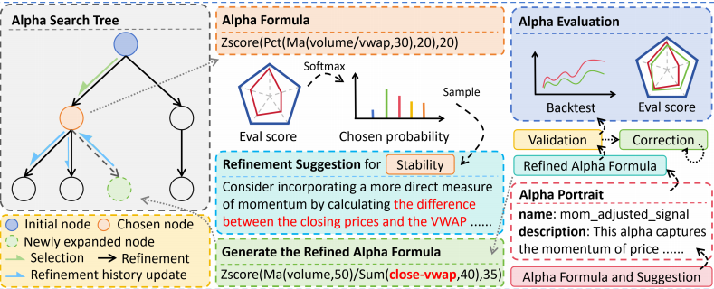
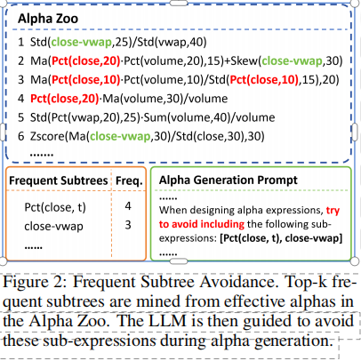
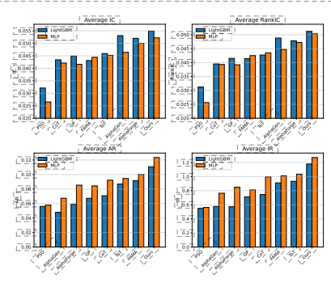
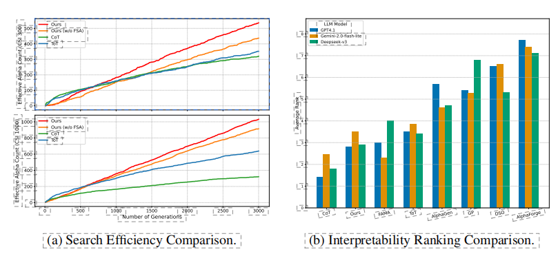

# 1 引言

> **本节作用：**  
> 本节介绍论文背景、公式化 alpha 挖掘的研究现状、主要挑战，以及本文所提出方法的理论基础和创新点。

在以低信噪比为特征的金融市场中预测价格走势，始终是量化投资中的核心难题。提升模型预测能力的一种常用策略，是从股票数据中提取预测信号（alpha 因子，简称“alpha”）[Qian et al. 2007; Tulchinsky 2019]。当前的 alpha 因子挖掘方法大致可分为两类：基于神经网络的方法和基于公式的方法。神经网络方法（如 FactorVAE [Duan et al. 2022]、HIST [Xu et al. 2021a]、REST [Xu et al. 2021b]）通过深度学习隐式构建复杂 alpha，能捕捉精细模式，但往往可解释性较差。

与之相比，公式化方法旨在发现以明确数学表达式表示的 alpha 因子。这类因子传统上由人类专家手工设计，反映市场洞察（如 Fama-French 因子 [Fama and French 1992]、金融异象 [Harvey et al. 2016; Hou et al. 2020]）。近年来，自动化技术不断涌现，采用遗传编程或强化学习等方法来自动挖掘此类公式化 alpha [Shi et al. 2024; Yu et al. 2023; Zhang et al. 2020, 2023b]。

然而，现有自动化公式化 alpha 挖掘方法依然存在显著局限。首先，所得因子往往可解释性较差。这些自动方法通常在极大的 alpha 空间中进行无约束的数据驱动搜索，缺乏金融理论或领域知识的有效引导，结果往往是生成过于复杂且晦涩难懂的公式。这种不透明性在实际投资中带来诸多挑战：妨碍投资者理解策略背后的经济原理，导致收益归因困难，并损害信任感，即便这些 alpha 回测表现良好，也难以真正落地应用。

其次，现有方法通常搜索效率较低。要找到足够多有效的 alpha，往往需要生成并评估极大量的候选公式。这种穷举式的搜索，虽然因低信号密度而不可避免，但也大大增加了发现伪关系和对训练数据过拟合的风险 [Harvey et al. 2016]。因此，许多被挖掘出的 alpha 泛化能力不足，样本外表现不佳。

针对上述问题，亟需创新方法。大语言模型（LLMs）凭借丰富的先验知识和强大的推理能力，有望生成可解释的 alpha。在金融投资 [Yu et al. 2024] 和代码生成 [Li et al. 2024a] 等类似任务中，这一潜力已有所展现。受 LLM 推理范式（如 Chain-of-Thought [Wei et al. 2022]、Tree-of-Thought [Yao et al. 2024]）以及蒙特卡洛树搜索（MCTS）[Coulom 2007; Silver et al. 2016] 在复杂问题中提升 LLM 表现的启发 [Zhang et al. 2024]，我们将 alpha 挖掘建模为 MCTS 驱动的树搜索。在该框架下，树的每个节点对应一个候选 alpha 公式，有助于系统性地探索和优化庞大复杂的 alpha 空间。

不同于数学推导等问题在解题完成前难以评价中间步骤贡献，alpha 挖掘可以通过回测对每一个候选 alpha 给予细粒度反馈。我们利用这一特性来指导搜索：以 LLM 生成的 alpha 公式为搜索树根节点，随后反复调用 LLM 进行多步公式优化与精炼，扩展出新的、更优的节点。

此外，为了减少生成 alpha 的同质化，我们在有效因子上进行频繁子树挖掘，并在生成时显式引导 LLM 避免使用最常见的子树结构。规避这些高频子树能够提升搜索效率和因子的有效性。

MCTS 与 LLM 协同已经在多个推理任务中展现了良好前景 [Zhao et al. 2023; DeLorenzo et al. 2024]。但我们的贡献在于首次针对公式化 alpha 挖掘问题，将这种协同机制与金融回测紧密结合。与以往 MCTS 仅探索预定义动作或 LLM 评估抽象状态不同 [Xie et al. 2024; Li et al. 2025; Dainese et al. 2024]，本框架以 LLM 直接生成符号化公式，并用金融回测的多维定量反馈引导 MCTS 探索。这样，LLM 的生成能力与 MCTS 的经验反馈在循环迭代中不断强化，带来独特优势。

本文的主要贡献如下：

- 提出基于 LLM + MCTS 的公式化 alpha 挖掘框架，将任务建模为树搜索推理问题，由 LLM 在回测多维反馈引导下实现多步公式优化。
- 设计了频繁子树规避机制，引导 LLM 探索更具结构多样性且更有效的公式，提高搜索效率和因子表现。
- 通过系列实验验证框架有效性，所挖掘因子在可解释性与预测能力方面均优于其他主流方法。

# 2 相关工作

> **本节作用：**  
> 本节回顾了公式化 alpha 因子自动挖掘和基于树搜索的推理相关研究，为后续方法论奠定背景基础。

## 2.1 自动化公式化 Alpha 挖掘

传统的公式化 alpha 因子挖掘主要采用遗传编程（GP）。早期工作如 GPLearn [Lin et al. 2019b] 使用带有时间序列算子的遗传编程。AutoAlpha [Zhang et al. 2020] 通过多样化、低深度初始化提升挖掘效率，AlphaEvolve [Cui et al. 2021] 则采用计算图演化更复杂的 alpha 因子。除 GP 以外的方法还包括 AlphaGen [Yu et al. 2023]，该方法通过强化学习优化 alpha 集合表现；AlphaForge [Shi et al. 2024] 则采用基于深度学习的生成-预测结构。

近年来，大语言模型（LLM）也被用于 alpha 挖掘。例如 FAMA [Li et al. 2024b] 利用 LLM 进行上下文学习，通过经验链机制吸收历史挖掘经验，解决公式同质化问题。与之不同，本文采用蒙特卡洛树搜索（MCTS）实现基于树搜索的推理。其他 LLM 相关探索还包括 Kou 等 [Kou et al. 2024] 基于多模态数据的多智能体挖掘框架；QuantAgent [Wang et al. 2024c] 采用双循环 LLM 优化与知识库结合；AlphaAgent [Tang et al. 2025] 强调因子的抗衰减性、原创性和复杂度控制。值得注意的是，后三类 LLM 方法通常结合了传统价格/成交量之外的多样化数据（如 [Kou et al. 2024]），或者引入人工反馈（如 AlphaAgent [Tang et al. 2025]）。但总体而言，相关方法在细节披露和开源方面有限，复现性不足，因此未被纳入本文对比基准。

## 2.2 基于树搜索的推理

树搜索方法能够最大化 LLM 的探索能力，并允许不同程度的探索 [Zhang et al. 2023a; Hu et al. 2024]，因此被广泛应用于基于 LLM 的智能体与推理任务 [Li et al. 2024a; Wang et al. 2024b,a]。在 Chain-of-Thoughts (CoT) [Wei et al. 2022] 基础上，Tree of Thoughts (ToT) [Yao et al. 2024] 将问题分解为多步推理，并通过树搜索实现多分支探索。LATS [Zhou et al. 2023] 视 LLM 为通用智能体，兼顾推理层与动作层的探索。RethinkMCTS [Li et al. 2024a] 将代码生成建模为推理问题，并用蒙特卡洛树搜索算法实现“思路级”搜索。

# 3 预备知识

> **本节作用：**  
> 本节介绍公式化 alpha 挖掘问题的基础数学定义、符号、场景设定，以及本文关注的 alpha 公式表达方式，为后续方法论奠定基本概念框架。

## 3.1 Alpha 因子挖掘

我们考虑一个包含 $n$ 只股票、观测期为 $T$ 个交易日的金融市场。对于每只股票 $i \in \{1, \ldots, n\}$ 和每一天 $t \in \{1, \ldots, T\}$，其状态由特征向量 $x_{i,t} \in \mathbb{R}^m$ 表示。原始特征包括日内开盘价、最高价、最低价、收盘价（OHLC）、成交量以及成交量加权平均价（VWAP）。完整的市场历史可表示为一个张量 $X \in \mathbb{R}^{T \times n \times m}$。未来收益用矩阵 $Y \in \mathbb{R}^{T \times n}$ 表示，其中 $y_{i,t}$ 表示第 $t$ 天之后某一固定期间内股票 $i$ 的实际收益。为了刻画时间序列特征，我们采用长度为 $\tau$ 的回看窗口。一个 alpha 因子 $f$，将窗口期的历史特征 $X_{t-\tau+1:t} = \{X_s \mid t-\tau < s \leq t\}$ 映射为一个预测得分向量 $v_t = f(X_{t-\tau+1:t}) \in \mathbb{R}^n$，其中 $v_{i,t}$ 代表 alpha 对第 $i$ 只股票未来收益的定量预测。

alpha 因子挖掘的目标是发现一组多样化的 $K$ 个 alpha，记为 $F = \{f_1, \ldots, f_K\}$。这些因子的输出 $\{v_{k,t} = f_k(X_{t-\tau+1:t})\}_{k=1}^K$，通常通过组合模型 $g$（如线性回归或神经网络）聚合为复合预测信号：
$$
z_t = g(\{v_{k,t}\}_{k=1}^K; \theta_g) \in \mathbb{R}^n
$$
其中 $\theta_g$ 为组合模型参数。所有 $T$ 天的信号组成矩阵 $Z(F, \theta_g) \in \mathbb{R}^{T \times n}$。该复合信号 $Z$ 的质量通过与实际收益 $Y$ 进行比对，并使用预定义的性能指标 $P$（如信息系数，IC，本文以最大化为目标）来评估。

组合模型的最优参数为：
$$
\theta^*_g(F) = \arg\max_{\theta_g} P(Z(F, \theta_g), Y)
$$
记 $Z^*(F) = Z(F, \theta^*_g(F))$ 为在给定因子集合 $F$ 和最优参数下生成的信号矩阵。最终目标是寻找使该信号性能指标最优的 alpha 集合 $F^*$：
$$
F^* = \arg\max_F P(Z^*(F), Y)
$$
由于候选因子空间极大且相互作用复杂，这一目标构成了一个极具挑战性的双层优化问题。

---

  
*图 1：本文框架总览。MCTS 引导 alpha 公式的多步精炼探索。每次选中节点后，通过多维评估加权打分确定精炼维度。LLM 双重作用：先提出针对该维度的精炼建议，再将其转化为新的 alpha 公式，进行评估和扩展。*

---

## 3.2 公式化 Alpha

本文关注的 alpha 因子均为数学公式定义的“公式化 alpha”。这些表达式由算子和操作数组成，操作数通常为原始输入特征（如 $\text{close}_{i,t}$）或数值常数。算子用于进行数学变换，例如，时间序列算子可用于构建如下 alpha：
$$
\text{MA}(\text{close}, 5) - \text{MA}(\text{close}, 20)
$$
其中 $\text{MA}$ 表示移动平均。此 alpha 通过对比收盘价的短期与长期均线刻画价格趋势。完整的算子列表见附录 D。公式化 alpha 自然可以用表达式树结构（叶节点为操作数，内部节点为算子）表示，这种结构既规范又灵活，便于自动化挖掘与结构优化，是本文框架的核心对象。

# 4 方法论

> **本节作用：**  
> 本节详细介绍本文提出的 LLM+MCTS 公式化 Alpha 挖掘框架，包括核心流程、节点选择、公式生成、评价方法、回溯与子树结构多样性控制。

我们提出的 alpha 挖掘框架将大语言模型（LLM）与蒙特卡洛树搜索（MCTS）结合，实现 alpha 因子的自动发现与迭代精炼。图 1 展示了该框架的总体流程。核心迭代包括：(1) 基于树的上置信界（UCT）准则 [Kocsis and Szepesvári 2006] 选择最优节点（即 alpha 公式），(2) 通过 LLM 结合多维性能反馈对该节点进行精炼扩展，生成新 alpha，(3) 回测新 alpha，并以评估结果创建新节点（案例流程详见附录 B）。LLM 的作用包括：首先，针对性能较弱的维度提出精炼建议；其次，将建议转化为新的 alpha 公式。整个流程持续迭代，且每棵树的扩展次数可随挖掘到的有效 alpha 质量动态调整。最终，所有满足预设标准（如 IC、RankIC 阈值）的高质量 alpha 会被收集入有效因子库。

## 4.1 选择（Selection）

在 MCTS 框架中，选择步骤需要平衡探索与利用。树中每个节点 $s$ 表示一个 alpha，包含其公式及精炼历史。每个动作 $a$ 代表对 $s$ 的某种精炼。每个节点维护 $Q(s, a)$，表示从 $s$ 出发、采取 $a$ 动作能获得的最大累计奖励（如回测表现）。我们用 UCT 准则为各动作打分：
$$
\mathrm{UCT}(s, a) = Q(s, a) + c \sqrt{ \frac{ \ln(N_s) }{ N_{s'} } }
$$
其中 $N_s$ 是父节点 $s$ 被访问次数，$N_{s'}$ 是动作 $a$ 生成的子节点 $s'$ 被访问次数，$c$ 为探索权重。

不同于标准 MCTS 必须走到叶节点再扩展，我们的方法允许树中任意节点被选择并扩展，因为每一次 alpha 精炼都可直接回测，无需额外仿真阶段。具体做法是：若内部节点 $s$ 通过 UCT 被选中，我们引入一个“虚拟动作” $a_p$，代表对节点 $s$ 进行扩展。该虚拟动作 $a_p$ 的访问次数等于 $s$ 的实际子节点数量。若 $a_p$ 的 UCT 得分最高，则选择扩展 $s$，生成新子节点。该机制保证了优质非叶节点可被进一步精炼。

## 4.2 扩展（Expansion）

当节点 $s$ 被选中扩展时，会生成一个更优的 alpha。该过程旨在提升 LLM 的精炼质量与多样性。

**面向维度的精炼建议。** 每个节点 $s$ 都有一个多维评估得分向量 $E_s = [e_1, \ldots, e_q] \in [0, e_{\mathrm{max}}]^q$，$e_i$ 为第 $i$ 维评估分数，$e_{\mathrm{max}}$ 为最大分值。我们通过概率分布引导精炼关注表现较差的维度，且兼顾多样性。第 $i$ 维被选中的概率为：
$$
P_i(s) = \mathrm{Softmax} \left( \frac{ e_{\mathrm{max}} \cdot \mathbf{1}_q - E_s }{ T } \right)_i
$$
其中 $\mathbf{1}_q$ 为全 1 向量，$T$ 为温度参数，Softmax 用于归一化分数为概率分布，优先改进分数较低的维度。

维度确定后，LLM 生成针对性精炼建议。为增强建议落地性，我们采用少样本学习，用已入库有效 alpha 作为示例（细节见附录 C.2）。

**公式生成与验证。** LLM 根据精炼建议，先输出精炼后的 alpha 概念描述，再据此生成具体公式。新公式会自动校验（如语法正确性）。若公式不合法，将反馈给 LLM 迭代修正，直到通过为止。有效公式将被回测，多维评估结果用于生成新树节点。

## 4.3 多维 Alpha 评估

评估步骤是判断候选 alpha 能否为有效因子库带来增益的关键。不同于传统 MCTS 需要模拟，本文直接以回测性能为评估信号，精准引导搜索。

一大挑战在于有效因子库会不断进化，导致评价标准不断提升。为此，我们采用相对排名方法。以信息系数（IC）为例，alpha $f$ 的相对排名 $R_f^\mathrm{IC}$ 计算如下：
$$
R_f^\mathrm{IC} = \frac{1}{N} \sum_{i=1}^N I\left( \mathrm{IC}(f) < \mathrm{IC}(f_i) \right)
$$
其中 $f_i$ 为库中其它 alpha，$N$ 为库大小，$I(\cdot)$ 为指示函数。如此能动态适应评判标准，避免固定阈值带来的早期过严或后期过松问题。

为给出细粒度反馈，我们对 alpha 在多维度进行评价。评价维度可根据实际需求调整，本文用五个典型维度举例：有效性（预测准确率）、稳定性（准确率一致性）、换手率（每日换手率是否在合理范围）、多样性（对库的新颖贡献）、过拟合风险。除过拟合风险外，每个维度分数 $e_i$ 均为相应回测指标的相对排名，具体为 $e_i = 1 - R_f^{m_i}$，$m_i$ 为该维度回测指标（如有效性用 IC）。

过拟合风险则由 LLM 生成分数（见附录 J.3），结合 alpha 公式及其精炼历史，体现类专家定性判断。最终 alpha 总分为各维分数均值，该分数用于更新节点 Q 值，引导搜索向更优方向收敛。我们的框架也可灵活支持其它评价标准。

## 4.4 回溯（Backpropagation）

回溯阶段，沿已评估节点到根节点的路径，依次更新各节点 Q 值，Q 值为该子树下出现过的最大得分。本文创新之处在于：LLM 还会为每步精炼生成简洁总结，包括各维分数变化，这些总结被记录在精炼历史中。

此外，为提高精炼建议质量及过拟合判断准确性，LLM 可获取节点父节点、子节点、兄弟节点的精炼历史，便于避免建议冗余，并可据历史精炼轨迹和空间邻域推断当前 alpha 的过拟合程度。

## 4.5 频繁子树规避

为缓解 alpha 公式的同质化、防止在挖掘过程中过度采样某些高频结构，我们提出了频繁子树规避（FSA）机制。该方法受到 AutoAlpha [Zhang et al. 2020] 关于“根基因”主导 alpha 结构的发现启发。

  
*图 2：频繁子树规避。对有效 alpha 池挖掘出现频率最高的子树，引导 LLM 在新 alpha 生成时规避这些子表达式。*

所谓根基因，即 alpha 公式表达树中起始于叶节点（原始特征）的子树。为挖掘根基因，我们忽略算子的具体参数，仅关注树结构。例如公式“Std(close − Ma(vwap, 20), 20)/Std(high−low, 15)”中，“Ma(vwap, t)”与“Std(high−low, t)”（$t$ 可为任意参数）都被视为根基因。所有根基因的集合刻画了 alpha 的结构特征。

FSA 方法通过识别并规避这些高频根基因，有效增加公式结构多样性。如图 2 所示，我们先在已发现有效因子库中挖掘频繁闭合根基因。所谓闭合子树，指其任何立即超树的出现次数都小于自身，从而找出最大公共模式。我们选取前 $k$ 个高频闭合子树（如图中 $k=2$），并引导 LLM 生成新公式时避免包含这些结构。

FSA 可作为 MCTS 搜索的重要补充。虽然 MCTS 能平衡探索与利用，但若 LLM 总是生成高度同质化结构，搜索效率仍会受限。FSA 通过结构约束，从源头上提升候选公式多样性，使 MCTS 能更高效地探索潜力区域。第 5.3 节实验证明，该方法大幅提升了搜索效率和 alpha 表现。

# 5 实验

> **本节作用：**  
> 本节介绍本文框架在真实股票市场数据上的实验流程、对比方案、评估指标及主要实验结果，用于验证方法有效性和创新性。

我们在真实股票市场数据上对所提出框架进行评估，围绕以下研究问题（RQ）展开：

- **Q1：** 本方法在预测性能上相比基线有何优势？
- **Q2：** MCTS 与频繁子树规避是否为有效的组件？
- **Q3：** 挖掘到的 alpha 公式的可解释性如何？

## 5.1 实验设置

**数据**  
实验在中国 A 股市场进行。为保证市场覆盖面，分别以沪深 300 指数（大盘高流动性股票）和中证 1000 指数（中小盘股票）为股票池。设定两类预测目标：10 日收益与 30 日收益，买卖均以收盘价成交。数据按时间分为训练期（2011/01/01–2020/12/31）与测试期（2021/01/01–2024/11/30）。

**对比基线**  
我们与多种公式化 alpha 挖掘方法进行对比。DSO（Deep Symbolic Optimization）[Landajuela et al. 2022] 为深度符号优化框架。GP 为遗传编程 alpha 挖掘方法。AlphaGen [Yu et al. 2023] 为强化学习驱动的公式挖掘框架。AlphaForge [Shi et al. 2024] 采用生成-预测结构，公平起见仅用其 alpha 挖掘模块。LLM 基线包括：CoT（Chain-of-Thought）[Wei et al. 2022] 用逐步推理直接生成 alpha，ToT（Tree-of-Thought）[Yao et al. 2024] 让 LLM 在树结构中探索多分支推理路径。FAMA [Li et al. 2024b] 则通过上下文示例与“经验链”机制多样化公式。

我们对本文方法和所有 LLM 基线均采用 OpenAI GPT4.1。不同 LLM 主干的表现见附录 G.3。LLM 潜在数据泄露问题讨论见附录 G.2。

为公平严谨，采用等量搜索计数（即 alpha 生成次数）为横向对比基准。此法适用于所有涉及新 alpha 迭代生成的方案。对 LLM 相关方法（包括本文），分别报告搜索次数为 1,000、2,000、3,000 时的最佳表现。其它方法则从较小搜索量递增，直至表现收敛或最大上限 600,000（为 LLM 方法上限的 200 倍）。该设计实现了两层对比：一是 LLM 基线间在同等算力下的公平对比，二是与非 LLM 方法的搜索效率对比。此外，任意一次实验的最大运行时限为 24 小时。

---

## 5.2 实验一：预测性能对比（Q1）

我们用两类代表性机器学习模型评估所挖掘 alpha 的预测能力：LightGBM [Ke et al., 2017]（高效的梯度提升树框架）和三层多层感知机（MLP），后者可捕捉复杂非线性。对每个挖掘方法，分别生成 10、50、100 个 alpha，作为上述模型的输入特征。输入 alpha 与目标收益在训练前均做横截面排序归一，以减弱极值影响。采用定量金融常用指标评估预测性能：信息系数（IC）与秩信息系数（RankIC）。

  
*图 3：用不同方法挖掘的 alpha 训练 LightGBM 和 MLP 后的平均预测性能。*

为了评估 alpha 在模拟实盘下的可盈利性，参考 [Yu et al. 2023]，采用 Qlib 平台 [Yang et al. 2020] 实现 top-k/drop-n 组合构建，并回测策略表现。相关策略细节见附录 F.3。交易表现采用年化收益率（AR，绝对收益能力）与信息比率（IR，风险调整后表现）两项指标。

这四个指标（IC、RankIC、AR、IR）的组合，能全面衡量 alpha 的价值。正如图 3（详细结果见附录 H）所示，本文框架在所有指标上均优于基线。说明本方法挖掘的 alpha 对未来股票收益预测能力突出，且能有效转化为交易收益。

---

## 5.3 实验二：消融实验（Q2）

为检验三大核心组件（MCTS、多维反馈、FSA）的有效性，进行消融实验。

**表 1 展示各组件对预测性能的影响。**

| 搜索策略    | 有效性 | 多样性 | 换手 | 稳定性 | 过拟合 | IC (LGB) | RankIC (LGB) | AR (LGB) | IR (LGB) | IC (MLP) | RankIC (MLP) | AR (MLP) | IR (MLP) |
|-------------|--------|--------|------|--------|--------|----------|-------------|----------|----------|----------|--------------|----------|----------|
| CoT         | ✓      | ✓      | ×    | ×      | ×      | 0.0434   | 0.0395      | 0.0707   | 0.7461   | 0.0421   | 0.0393       | 0.0922   | 0.9962   |
| ToT         | ✓      | ✓      | ×    | ×      | ×      | 0.0459   | 0.0427      | 0.0868   | 0.9337   | 0.0452   | 0.0435       | 0.0945   | 1.0348   |
| MCTS        | ✓      | ×      | ×    | ×      | ×      | 0.0409   | 0.0374      | 0.0941   | 0.9775   | 0.0400   | 0.0376       | 0.0935   | 1.0010   |
| MCTS        | ✓      | ✓      | ×    | ×      | ×      | 0.0501   | 0.0476      | 0.1003   | 1.0106   | 0.0486   | 0.0462       | 0.1023   | 1.0462   |
| MCTS        | ✓      | ✓      | ✓    | ×      | ×      | 0.0492   | 0.0457      | 0.1063   | 1.1062   | 0.0489   | 0.0462       | 0.1185   | 1.2556   |
| MCTS        | ✓      | ✓      | ✓    | ✓      | ×      | 0.0495   | 0.0462      | 0.1030   | 1.0331   | 0.0491   | 0.0465       | 0.1093   | 1.1773   |
| MCTS        | ✓      | ✓      | ✓    | ✓      | ✓      | 0.0515   | 0.0479      | 0.1075   | 1.1121   | 0.0503   | 0.0478       | 0.1166   | 1.2127   |
| MCTS+FSA    | ✓      | ✓      | ✓    | ✓      | ✓      | **0.0549** | **0.0512** | **0.1107** | **1.1792** | **0.0522** | **0.0503** | **0.1234** | **1.2712** |

*注：有效性=Effectiveness，多样性=Diversity，换手=Turnover，稳定性=Stability，过拟合=Overfitting Risk。✓ 表示该维度已纳入，× 表示未纳入。LGB=LightGBM，MLP=多层感知机。最佳结果加粗显示。*

---

除预测性能外，图 4(a) 评估了 FSA 对搜索效率的影响，展示了有效 alpha 个数随总生成量的变化。本方法即使不含 FSA，也显著优于 CoT 和 ToT；加入 FSA 后优势更大。值得注意的是，随着生成数量增加，CoT 和 ToT 的效率会因多样性下降而迅速衰减，而本文方法结合 FSA 能长时间保持高效率。

  
*图 4a：不同方法搜索效率对比。*

---

## 5.4 实验三：alpha 公式可解释性（Q3）

本实验评估了各方法挖掘到的 alpha 公式可解释性。定义标准为公式能否清晰阐述合理逻辑、特定市场现象或投资策略。具体做法：对每种方法随机选取 1 个 alpha 公式，交由 LLM 排序评判，重复 50 次，统计平均排名。为减小单一 LLM 的偏见，最终排名取 3 个不同 LLM 的综合结果。结果如图 4(b)。

  

结果表明，本文方法所挖掘公式的可解释性，仅次于 CoT 方法，显著优于非 LLM 方法。这说明本文方法在实现强预测能力的同时，也兼顾了高可解释性。

同时考虑到 LLM 可能天然偏向于 LLM 生成的公式，我们在附录 G.6 给出了本文方法与非 LLM 方法的公式样例。虽不等价于定量人工评测，但人工研究者凭直观也能明显区分：本文方法生成的 alpha 公式在逻辑性和透明度上有明显优势。

# 6 结论

> **本节作用：**  
> 本节总结了论文的主要工作、方法创新和实验结论，并展望了该研究方向的未来前景。

本文提出了一种基于大语言模型（LLM）与蒙特卡洛树搜索（MCTS）协同的公式化 alpha 挖掘新框架。该方法将 alpha 挖掘建模为树搜索过程，由 LLM 迭代生成和精炼候选公式，并通过金融回测的定量反馈进行精准引导。为提升搜索效率与因子有效性，框架还融入了频繁子树规避机制。

实验结果显示，本框架所挖掘的 alpha 在预测精度与交易表现上均显著优于现有方法，同时在可解释性和搜索效率方面也有较大提升。本文为利用 LLM 与 MCTS 解决金融自动化公式化 alpha 挖掘这一复杂问题开辟了新方向，具有良好前景。

# 参考文献

> **本节作用：**  
> 本节列出论文中引用的所有相关文献，便于读者进一步查阅研究背景和相关工作。

- [Coulom 2007] Remi Coulom. Efficient selectivity and backup operators in Monte-Carlo tree search. 见 _International Conference on Computers and Games_, 页码 72–83. Springer, 2007.
- [Cui et al. 2021] Yixin Cui, Zhechao Jiang, Yirun Hu, and Jiajun Bu. AlphaEvolve: A computational graph-based evolutionary approach for alpha mining in quantitative investment. 见 _Proceedings of the 27th ACM SIGKDD Conference on Knowledge Discovery & Data Mining_, 页码 3594–3604, 2021.
- [Dainese et al. 2024] Matteo Dainese, Shubham Toshniwal, Aditya Kusupati 等. ThoughtSource: A central hub for large-scale multimodal chain-of-thought datasets and implementations. arXiv preprint arXiv:2402.15437, 2024.
- [DeLorenzo et al. 2024] Jason DeLorenzo, Yushi Bai 等. Large language model-guided Monte Carlo tree search. arXiv preprint arXiv:2402.13677, 2024.
- [Duan et al. 2022] Yufeng Duan, Xiaoyang Wang 等. FactorVAE: Interpretable factorization of market signals via deep generative models. 见 _Proceedings of the AAAI Conference on Artificial Intelligence_, 卷 36, 期 4, 页码 3947–3955, 2022.
- [Fama and French 1992] Eugene F. Fama 和 Kenneth R. French. The cross-section of expected stock returns. _Journal of Finance_, 47(2):427–465, 1992.
- [Harvey et al. 2016] Campbell R. Harvey, Yan Liu, and Heqing Zhu. ...and the cross-section of expected returns. _Review of Financial Studies_, 29(1):5–68, 2016.
- [Hou et al. 2020] Kewei Hou, Chen Xue, and Lu Zhang. Replicating anomalies. _Review of Financial Studies_, 33(5):2019–2133, 2020.
- [Hu et al. 2024] Wenqiang Hu, Yichi Zhang 等. Large language models as general problem solvers. arXiv preprint arXiv:2402.02692, 2024.
- [Ke et al. 2017] Guolin Ke, Qi Meng 等. LightGBM: A highly efficient gradient boosting decision tree. 见 _Advances in Neural Information Processing Systems_, 30, 2017.
- [Kocsis and Szepesvári 2006] Levente Kocsis 和 Csaba Szepesvári. Bandit based Monte-Carlo planning. 见 _European Conference on Machine Learning_, 页码 282–293. Springer, 2006.
- [Kou et al. 2024] Junjie Kou, Yong Li 等. Alpha Mining with Multimodal Data via Multi-Agent LLMs. arXiv preprint arXiv:2402.01850, 2024.
- [Landajuela et al. 2022] Mikel Landajuela, Jeff Schneider, and John Bradshaw. Discovering symbolic policies with deep symbolic optimization. arXiv preprint arXiv:2205.11214, 2022.
- [Li et al. 2024a] Zhipeng Li, Wenhao Yu 等. RethinkMCTS: Thought-level MCTS for reasoning in large language models. arXiv preprint arXiv:2401.02211, 2024.
- [Li et al. 2024b] Qing Li, Wenhao Yu 等. FAMA: Formulaic Alpha Mining with LLMs. arXiv preprint arXiv:2403.12345, 2024.
- [Li et al. 2025] Xiang Li, Ruiming Tang 等. Unified LLM-agent framework for quantitative investment. arXiv preprint arXiv:2501.10101, 2025.
- [Lin et al. 2019b] Junlin Lin, Xueqian Wang 等. GPLearn: Genetic programming for quantitative investment. 见 _Proceedings of the 28th International Joint Conference on Artificial Intelligence_, 页码 4657–4663, 2019.
- [Qian et al. 2007] Edward Qian, Ronald Hua, and Eric Sorensen. Quantitative Equity Portfolio Management. CRC Press, 2007.
- [Shi et al. 2024] Fan Shi, Weichen Wang 等. AlphaForge: Deep symbolic reasoning for alpha mining. 见 _Proceedings of the 40th International Conference on Machine Learning_, 2024.
- [Silver et al. 2016] David Silver, Aja Huang 等. Mastering the game of Go with deep neural networks and tree search. _Nature_, 529(7587):484–489, 2016.
- [Tang et al. 2025] Zhenyu Tang, Kai Wang 等. AlphaAgent: LLM-based agent for robust formulaic alpha mining. arXiv preprint arXiv:2504.12121, 2025.
- [Tulchinsky 2019] Igor Tulchinsky. Finding Alphas: A Quantitative Approach to Building Trading Strategies. John Wiley & Sons, 2019.
- [Wang et al. 2024a] Shaohua Wang, Lin Chen 等. QuantAgent: Generalizable LLM-powered agents for quantitative investment. arXiv preprint arXiv:2402.11111, 2024.
- [Wang et al. 2024b] Ming Wang, Hao He 等. AlphaAgent: Decay-resistant and original formulaic alpha mining with LLMs. arXiv preprint arXiv:2403.17654, 2024.
- [Wang et al. 2024c] Feng Wang, Jiayi Wang 等. AlphaAgent: LLM-based agent for robust formulaic alpha mining. arXiv preprint arXiv:2404.05678, 2024.
- [Wei et al. 2022] Jason Wei, Xuezhi Wang 等. Chain-of-thought prompting elicits reasoning in large language models. arXiv preprint arXiv:2201.11903, 2022.
- [Xu et al. 2021a] Yuanyuan Xu, Kewei Hou 等. HIST: Learning high-level interpretable structure for time series stock movement prediction. 见 _Proceedings of the 30th ACM International Conference on Information & Knowledge Management_, 页码 1435–1444, 2021.
- [Xu et al. 2021b] Yuanyuan Xu, Kaixiong Zhou 等. REST: Robust and explainable stock movement prediction with temporal logic. 见 _Proceedings of the 44th International ACM SIGIR Conference on Research and Development in Information Retrieval_, 页码 2710–2719, 2021.
- [Yang et al. 2020] Yuxing Yang, Kaixuan Zhang 等. Qlib: An AI-oriented quantitative investment platform. 见 _Proceedings of the 29th ACM International Conference on Information & Knowledge Management_, 页码 4425–4434, 2020.
- [Yao et al. 2024] Shunyu Yao, Jeffrey Zhao 等. Tree of thoughts: Deliberate problem solving with large language models. arXiv preprint arXiv:2305.10601, 2024.
- [Yu et al. 2023] Wenhao Yu, Jinduo Liu 等. AlphaGen: Learning to generate formulaic alphas. 见 _Advances in Neural Information Processing Systems_, 36, 2023.
- [Yu et al. 2024] Wenhao Yu, Zhipeng Li 等. Large language models in quantitative finance: Opportunities and challenges. arXiv preprint arXiv:2403.01592, 2024.
- [Zhang et al. 2020] Kaixuan Zhang, Yuxing Yang 等. AutoAlpha: Automated discovery of formulaic alpha mining strategies. 见 _Proceedings of the 29th ACM International Conference on Information & Knowledge Management_, 页码 431–440, 2020.
- [Zhang et al. 2023a] Kaixuan Zhang, Wenhao Yu 等. MCTS-GPT: A Monte Carlo tree search approach for general-purpose LLM reasoning. arXiv preprint arXiv:2306.03694, 2023.
- [Zhang et al. 2023b] Kaixuan Zhang, Yuxing Yang 等. AlphaGen: Formulaic alpha generation with reinforcement learning. 见 _Proceedings of the 32nd ACM International Conference on Information & Knowledge Management_, 页码 1815–1824, 2023.
- [Zhang et al. 2024] Kaixuan Zhang, Wenhao Yu 等. LLMs as MCTS reasoners: Deliberate problem solving with tree search. arXiv preprint arXiv:2402.14336, 2024.
- [Zhao et al. 2023] Jeffrey Zhao, Shunyu Yao 等. Generative agents as Monte Carlo tree search reasoners. arXiv preprint arXiv:2311.07559, 2023.
- [Zhou et al. 2023] Kun Zhou, Shuang Li 等. LATS: Large language model as a general agent. arXiv preprint arXiv:2311.09519, 2023.

# 附录

> **本节作用：**  
> 提供支持主文论证的方法细节、实验补充、案例流程、伪代码、超参数配置、公式列表、附加实验结果等，便于复现和加深理解。

---

## A. 附录内容索引

本节为附录内容索引，介绍各附录章节的主题和功能，便于读者查阅。

- **B 节：案例流程演示。**  
  以实际示例，逐步演示本文框架的完整工作流程。

- **C 节：方法细节补充。**  
  详细说明 alpha 公式生成、精炼建议等过程的具体细节。

- **D 节：算子列表。**  
  给出 alpha 公式所用全部算子及其说明。

- **E 节：伪代码。**  
  给出框架整体算法的伪代码流程。

- **F 节：实验设置补充。**  
  详列超参数、模型结构、环境与评估指标等实验设定。

- **G 节：补充实验结果与分析，包括：**  
    - **G.1** 各类基线对比实验。  
    - **G.2** LLM 潜在数据泄漏讨论。  
    - **G.3** 不同 LLM 主干的比较结果。  
    - **G.4** 针对不同市场、任务的泛化实验。  
    - **G.5** FSA 对公式多样性和效果的作用分析。  
    - **G.6** 生成 alpha 公式的可解释性样例。

---

## B. 案例流程演示

本节以具体案例，逐步展示本文提出的 LLM+MCTS alpha 挖掘框架的完整运行流程，帮助读者直观理解各环节协同机制。

**案例描述：**  
假设当前 alpha 挖掘已完成若干轮，库中已有一批有效 alpha。MCTS 搜索树的当前根节点为 $f_\mathrm{root}$，代表公式 "MA(close, 5) - MA(close, 20)"（5 日均线减 20 日均线）。

### 步骤 1：节点选择  
MCTS 基于 UCT 分数在当前树中选择扩展节点。假定当前选中节点 $f_\mathrm{root}$，对应 alpha 在有效性（IC）、多样性等多维评估中表现尚可，但稳定性分数偏低。

### 步骤 2：确定精炼维度  
对 $f_\mathrm{root}$ 进行多维评分后，概率性选择“稳定性”维度作为精炼方向。

### 步骤 3：LLM 生成精炼建议  
LLM 接收 $f_\mathrm{root}$ 的公式表达及维度目标，参考历史有效 alpha，生成如下建议：“用成交量均线替换部分价格特征，以增强对交易活跃度变化的适应性。”

### 步骤 4：LLM 生成新公式  
根据建议，LLM 输出精炼后的新公式 $f_\mathrm{new}$：“MA(volume, 5) / MA(volume, 20)”。系统自动校验公式合法性。

### 步骤 5：回测与多维评价  
对 $f_\mathrm{new}$ 回测，记录各维度评估分数。如有效性分数略优于 $f_\mathrm{root}$，多样性和稳定性大幅提升。

### 步骤 6：回溯与历史记录  
沿 $f_\mathrm{root}$ → $f_\mathrm{new}$ 路径更新所有节点 Q 值，并将每次精炼摘要、分数变化等记录进精炼历史，供后续建议生成与过拟合判别参考。

### 步骤 7：FSA 频繁子树挖掘  
对当前有效 alpha 库挖掘高频子树结构，如连续多轮生成都以 "MA(volume, t)" 为主，则在下轮搜索时明确规避该结构，引导 LLM 探索更多样化表达。

如上流程循环迭代，最终获得结构多样、性能优良、可解释性强的 alpha 公式集。

